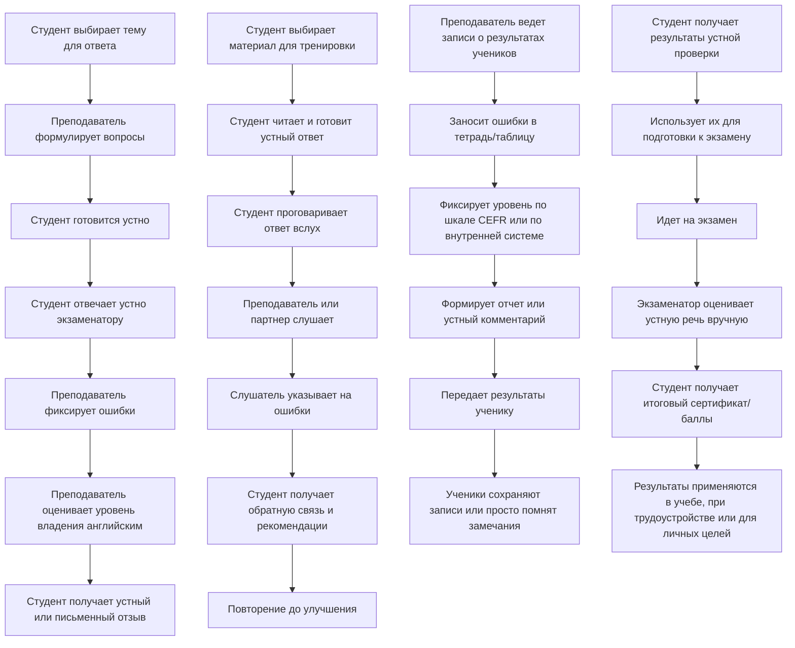

# Лабораторная работа 1  

---

## Оглавление
1. [Название и цели лабораторной работы](#название-и-цели-лабораторной-работы)  
2. [Постановка задачи для проектирования](#постановка-задачи-для-проектирования)  
3. [Анализ конкурентов](#анализ-конкурентов)  
4. [Опросник и результаты опроса](#опросник-и-результаты-опроса)  
5. [Профили пользователей](#профили-пользователей)  
6. [Профили задач](#профили-задач)  
7. [Профили среды](#профили-среды)  
8. [Профили групп](#профили-групп)  
9. [Персонажи](#персонажи)  
10. [Контекстные сценарии](#контекстные-сценарии)  
11. [Анализ задач и ролей пользователей](#анализ-задач-и-ролей-пользователей)  
12. [Объектная модель](#объектная-модель)  
13. [Стратегия дизайна](#стратегия-дизайна)  
14. [Диаграммы бизнес-процессов](#диаграммы-бизнес-процессов)  
15. [Общие выводы по лабораторной работе](#общие-выводы-по-лабораторной-работе)  

---

## Название и цели лабораторной работы
**Тема:** Исследование пользователей и предметной области  

### Цели работы:
1. Закрепить теоретические знания по разработке пользовательского интерфейса.  
2. Получить практические навыки по проведению этапов предварительного и высокоуровневого проектирования интерфейса пользователя.  
   - Научиться формулировать задание на проектирование прототипа программной системы, включая требования для прототипа мобильного устройства.  
   - Проводить исследования потребностей пользователей системы.  
   - Анализировать собранные данные.  
   - Формировать профили групп пользователей и выполнять синтез персонажей.  
   - Разрабатывать контекстные сценарии взаимодействия и диаграммы бизнес-процессов.  

---

## Постановка задачи для проектирования
Необходимо разработать iOS-приложение, web-приложение и серверную часть.  
Основной функционал системы заключается в оценке уровня владения английским языком пользователя на основе его устных ответов в формате аудио.  

### 1. Выбор темы и списка вопросов
- Отображение доступных тем для оценки (например: путешествия, работа, хобби).  
- Генерация списка вопросов по выбранной теме.  

### 2. Запись и загрузка аудио-ответов
- Возможность записи голосового ответа прямо в iOS-приложении или web-клиенте.  
- Отправка аудио-файла на сервер для последующей обработки.  

### 3. Серверная обработка
- Обработка аудио с помощью сервиса распознавания речи (ASR).  
- Анализ текста для оценки уровня английского языка.  
- Формирование итогового отчета с результатами анализа.  

### 4. Результаты и статистика
- Отображение пользователю уровня владения английским (по шкале CEFR: A1–C2).  
- Отображение использованных пользователем слов с указанием их уровня сложности (A1–C2).  
- Вывод грамматических ошибок с исправлениями.  
- Предложение вариантов по перефразированию выражений для более естественного звучания.  
- Общее резюме ответа пользователя.  

---

## Анализ конкурентов

### 1. Список конкурентов
**Ключевые игроки**  
Доминирующие глобальные платформы с самой большой пользовательской базой и определяющие основные тенденции на рынке:  
- Duolingo (лидер по количеству пользователей и загрузок).  
- Rosetta Stone (метод полного погружения).  
- Babbel.  

**Прямые конкуренты**  
Предлагают схожий функционал и ориентированы на ту же аудиторию:  
- Memrise (лексика, интервальные повторения, видео с носителями языка).  
- Busuu.  
- Lingualeo.  

**Косвенные конкуренты**  
Не полные аналоги, но удовлетворяют близкие потребности:  
- Anki и Quizlet — приложения для карточек.  
- HelloTalk — языковой обмен с носителями.  
- Verbling — занятия с репетиторами.  
- ELSA Speak — тренировка произношения.  

**Глобальные игроки**: Duolingo, Rosetta Stone (миллионы пользователей по всему миру).  
**Локальные игроки**: Puzzle English (русскоязычный сегмент).  

---

### 2. Анализ ценовой составляющей
**Duolingo**  
- Модель: freemium.  
- Бесплатные курсы — ключ к массовому охвату.  
- Ограничения: реклама, «жизни», отсутствие офлайн-уроков.  
- Подписка Super Duolingo: $12.99 / месяц, $59.99 / год.  
- Проблема: пользователи довольны бесплатным функционалом → низкая конверсия в платные подписки.  

**Memrise**  
- Модель: freemium.  
- Бесплатный базовый функционал, премиум доступен по подписке.  
- Цена Memrise Pro: $14.99 / месяц, $61.99 / год.  
- Дороже годовой подписки Duolingo.  

**Rosetta Stone**  
- Нет бесплатной версии.  
- Цена: около $120 / год.  
- Ориентация на мотивированных и платежеспособных пользователей.  

---

### 3. Объем трафика и динамика развития
**Duolingo**  
- MAU: 103.6 млн (Q1 2024).  
- DAU: 34.1 млн (33% вовлеченности).  
- Суммарные загрузки: >950 млн.  
- Июль 2024: 14.3 млн загрузок (лидер рынка).  
- Финансы: $748 млн выручки (2023), рост +40.8%.  
- Подписки: $404.68 млн, 8 млн платных подписчиков (рост >50% ежегодно за 5 лет).  

**Memrise**  
- 65–70 млн зарегистрированных пользователей.  
- >10 млн загрузок в Google Play.  

**Rosetta Stone**  
- Один из старейших брендов.  
- Сильные позиции в B2B-сегменте (корпоративные клиенты, учебные заведения).  

### 4. Региональная популярность платформ
- **Duolingo** — абсолютный лидер по количеству пользователей и загрузок. В июле 2024 года занимал первое место по ежемесячным загрузкам, значительно опережая конкурентов.  
- **Memrise** — на октябрь 2023 года основные источники трафика: США (15.81%), Вьетнам (13.66%), Великобритания (11.84%). Это указывает на его региональную популярность.  
- **Rosetta Stone** — сильные позиции в B2B-сегменте, работает с корпоративными клиентами и образовательными учреждениями.  

---

### 5. Рейтинг каналов привлечения трафика
- **Duolingo**  
  - Более 82% трафика на сайт — прямой (доказательство высокой узнаваемости бренда).  
  - Основные соцмедиа-каналы:  
    - YouTube — 52.57% трафика.  
    - Facebook — 15.34%.  
  - Основной инструмент роста — контент-маркетинг, особенно видеоконтент.  

- **Memrise**  
  - Подробные данные о каналах привлечения отсутствуют.  
  - Судя по всему, компания делает ставку на органический рост и силу бренда, а не на агрессивный маркетинг.  

- **Rosetta Stone**  
  - Делает акцент на платные каналы:  
    - Apple Ads (до 20% новых клиентов).  
    - Платная реклама в соцсетях (Facebook, YouTube).  
  - Подход ориентирован на прямую конверсию.  

---

### 6. Потребительский портрет клиентов конкурентов
- **Duolingo**  
  - Гендер: мужчины 49.91%, женщины 50.09%.  
  - Основная аудитория: 18–24 года (30.50%), далее — 25–34 года.  
  - Сильные стороны: игровой, лёгкий формат обучения, мотивация через геймификацию.  
  - Болевые точки: монотонность заданий на продвинутых уровнях → снижение мотивации.  

- **Memrise**  
  - Гендер: женщины — 53.21% (небольшой перевес).  
  - Основная аудитория: 18–24 года (30.62%), 25–34 года (27.47%).  
  - Сильные стороны: пользовательские курсы, созданные сообществом.  
  - Проблема: в 2024 курсы перенесены на отдельный сайт → массовый отток пользователей.  

- **Rosetta Stone**  
  - Целевая аудитория: серьёзные, мотивированные ученики, профессионалы и корпоративные клиенты.  
  - Особенности: делает акцент на уникальной технологии, включая систему распознавания речи.  

## Опросник и результаты опроса

В ходе выполнения лабораторной работы был создан **“Опрос о практике изучения английского языка”**.  
Доступ к нему можно получить по [ссылке](https://forms.gle/hPBCtTP5CpLNEC2LA).

### Результаты опроса

## Профили пользователей

На основании проведённого опроса и анализа конкурентов выделены четыре основных профиля пользователей. Для каждого профиля приведены: социальные характеристики, навыки и умения работы с компьютером/устройствами, мотивационно-целевая среда, рабочая/пользовательская среда, особенности взаимодействия с приложением и ключевые требования к ПО.

**Общее наблюдение из опроса:**  
Большинство респондентов — молодые взрослые (18–34), преимущественно используют смартфон, уровень — чаще B1–B2.  
Ключевые потребности: быстрая обратная связь по устной речи, разбор ошибок и рекомендации по словарю/произношению.

---

### Профиль A — «Молодой студент / учащийся» (Primary)
- **Социальные характеристики:** возраст 18–24, любой пол, студент/учёба.  
- **Навыки и умения:** уверенное пользование смартфоном; базовые навыки веб-приложений; умеет записывать голос на телефон.  
- **Мотивационно-целевая среда:** подготовка к экзаменам, улучшение карьерных перспектив, мотивация высокая при видимом прогрессе.  
- **Рабочая среда:** смартфон (iOS), домашняя и дорожно-транспортная среда, короткие сессии (10–30 мин), нестабильный мобильный интернет в дороге.  
- **Особенности взаимодействия / требования:** интуитивный интерфейс, быстрый результат, подсказки по ошибкам и словарю, элементы геймификации повышают вовлечённость; ожидает бесплатный базовый функционал.  

---

### Профиль B — «Подросток / школьник» (Secondary)
- **Социальные характеристики:** до 18 лет, школьник.  
- **Навыки и умения:** базовые цифровые навыки; может требоваться сопровождение родителей.  
- **Мотивационно-целевая среда:** подготовка к школьным экзаменам, мотивация частично внешняя (родители/школа).  
- **Рабочая среда:** смартфон, занятия дома и в школе, короткие регулярные сессии.  
- **Особенности взаимодействия / требования:** очень простой и визуальный интерфейс, понятные объяснения, игровые элементы, защита данных и возможность родительского доступа к отчётам.  

---

### Профиль C — «Молодой специалист / IT-профессионал» (Primary / Power user)
- **Социальные характеристики:** 25–34 года, специалисты IT/инженеры; техничен.  
- **Навыки и умения:** высокий уровень владения устройствами (смартфон + ноутбук), комфортен с экспортом/интеграциями.  
- **Мотивационно-целевая среда:** карьерный рост, подготовка к собеседованиям, общение с иностранными коллегами.  
- **Рабочая среда:** домашний ПК/ноутбук и смартфон, короткие целевые сессии, может использовать в дороге.  
- **Особенности взаимодействия / требования:** точность ASR для технических терминов, быстрая обработка, возможность сохранять/экспортировать отчёты, платная подписка приемлема при высокой ценности.  

---

### Профиль D — «Опытный профессионал / менеджер» (Secondary / Advanced)
- **Социальные характеристики:** 35–55+ лет, менеджеры, специалисты с малым временем на практику.  
- **Навыки и умения:** средний/высокий уровень цифровой грамотности; предпочитает лаконичные интерфейсы.  
- **Мотивационно-целевая среда:** эффективность, деловая коммуникация, подготовка к командировкам и переговорам.  
- **Рабочая среда:** ноутбук/рабочее место, нуждается в приватности и экспресс-аналитике.  
- **Особенности взаимодействия / требования:** экспресс-режим анализа, отчёты в удобном формате (PDF), высокая точность, возможность настройки критериев оценки.

## Профили задач

Список задач, сгруппированных по приоритетности и назначению. Для каждой задачи указаны **частота** (на основе опроса), **важность** и **влияние на интерфейс/архитектуру**.

---

### Категория 1 — Критические (реализовать в первую очередь)

**1. Проведение устного теста**  
*Процесс: выбор темы → вопросы → запись аудио → отправка*  
- **Частота:** высокая (регулярно)  
- **Важность:** критическая (ядро продукта)  
- **Влияние:** требуется стабильный модуль записи, UI для выбора тем/вопросов, индикатор загрузки  

**2. Запись и загрузка аудио / управление записями**  
*Функции: записать / повторить / предпрослушать*  
- **Частота:** всегда при ответе  
- **Важность:** критическая  
- **Влияние:** UX для удобного управления записью, поддержка автосохранения и повторных попыток  

**3. ASR-обработка и получение текстовой расшифровки**  
- **Частота:** каждый ответ  
- **Важность:** критическая (точность напрямую влияет на качество анализа)  
- **Влияние:** необходимость обработки в фоне, индикации статуса, обработка ошибок сети  

**4. Анализ и формирование отчёта**  
*Покрываемые аспекты: CEFR, грамматика, лексика, рекомендации*  
- **Частота:** каждый тест  
- **Важность:** высокая  
- **Влияние:** UI для представления результатов, возможность перехода в детальный разбор  

---

### Категория 2 — Важные (вторая очередь)

**1. История результатов и статистика прогресса**  
- **Частота:** часто для активных пользователей  
- **Важность:** средне-высокая  
- **Влияние:** хранение данных, визуализация (графики / диаграммы)  

**2. Словарь и пометки CEFR по использованным словам**  
- **Частота:** при просмотре отчёта  
- **Важность:** средняя  
- **Влияние:** интерфейс словаря, подсказки замены слов  

**3. Рекомендации по перефразированию и улучшению естественности**  
- **Частота:** регулярно  
- **Важность:** высокая  
- **Влияние:** генератор альтернативных фраз, примеры для обучения  

---

### Категория 3 — Дополнительные (дальнейшая очередь)

- Геймификация (баллы, достижения)  
- Социальные функции (чат, языковые клубы)  
- Экспорт отчётов / интеграции (PDF, LMS)

## Профили среды

Определены ключевые контексты и технические условия, в которых будет использоваться приложение, а также их влияние на проектирование интерфейса.

---

### Контексты использования

- **Дома:** тихая среда, стабильный Wi-Fi; допустима подробная аналитика и длительная обработка.  
- **В дороге / транспорт:** шум, переменный сигнал сети, короткие сессии; важна устойчивость ASR к шуму, возможность офлайн-кеширования вопросов.  
- **На работе / учёбе:** возможность использования на ПК/ноутбуке; важны приватность и быстрый экспресс-режим.  
- **Языковые клубы / группы:** коллективная среда, возможны публичные демонстрации; требует настроек приватности.  

---

### Аппаратные характеристики

- **Смартфон (iOS):** основной форм-фактор; предусмотреть управление одной рукой, крупные кнопки записи, тёмная/светлая тема.  
- **ПК/ноутбук:** для детального анализа и экспорта отчётов; поддержка современных браузеров.  
- **Микрофон:** качество сильно варьируется → встроенные подсказки по улучшению записи и опции шумоподавления на сервере.  

---

### Сетевые условия

- Поддержка слабых мобильных сетей: асинхронная загрузка, прогресс-индикатор, повторная отправка.  
- Кеширование тем/вопросов для офлайн-режима.  

---

### Влияние среды на интерфейс

- Крупные элементы управления и понятные статусы загрузки для мобильных.  
- Быстрые экспресс-ответы и лаконичные карточки результатов для деловой среды.  
- Визуализация прогресса и награды в образовательной среде (геймификация).

## Профили групп

На основе сочетания пользовательских профилей, профилей задач и среды выделены целевые группы (сегменты) с приоритетом для разработки и маркетинга.

---

### Группа 1 — «Учебный сегмент» (Primary)
- **Состав:** школьники и студенты (A1–B2)  
- **Ключевые задачи:** подготовка к экзаменам, регулярная практика устной речи, получение подробной обратной связи  
- **Требования:** простой UI, геймификация, бесплатный базовый функционал; поддержка родительских отчётов (для несовершеннолетних)  

---

### Группа 2 — «Профессионалы / карьеристы» (Primary / Secondary)
- **Состав:** молодые специалисты и менеджеры (B1–C2)  
- **Ключевые задачи:** подготовка к собеседованиям, деловая речь, экспорт отчётов для работодателя/коуча  
- **Требования:** точность анализа, быстрый экспресс-режим, опции приватности, удобный экспорт (PDF)  

---

### Группа 3 — «Путешественники / практики общения» (Secondary)
- **Состав:** пользователи с целью общения и путешествий (все уровни)  
- **Ключевые задачи:** краткие практические сценарии (путешествия), офлайн-доступ к темам, устойчивость в шуме  
- **Требования:** короткие упражнения, офлайн-режим тем, адаптация к шуму  

---

### Группа 4 — «Продвинутые и тестовые пользователи» (Niche)
- **Состав:** пользователи C1–C2, преподаватели, экзаменаторы  
- **Ключевые задачи:** глубокий анализ стиля, детальная обратная связь, настройка критериев оценки  
- **Требования:** продвинутые отчёты, тонкие рекомендации, платные функции  

---

**Приоритизация продукта:**  
Сначала реализовать группы 1 и 2 (основной доход и наибольшая численность), далее — поддержка группы 3 и расширенные функции для группы 4.

## Персонажи

### Ключевые персонажи

#### 1) Ирина — «Молодая студентка»
- **Возраст / соц. положение:** 20 лет, студентка  
- **Цели:** быстро получить развёрнутую обратную связь по устной речи; подготовиться к экзаменам  
- **Рабочий процесс:** короткие практические сессии на смартфоне (iOS) по дороге/дома; ожидает мгновенных результатов  
- **Окружение:** дома и в дороге; часто шумно в транспорте; мобильный интернет нестабилен  
- **Уровень подготовки:** уверенно пользуется смартфоном, простыми веб-приложениями  
- **Неудовлетворённости / ожидания:** бесплатный базовый функционал, интуитивный UI, подсказки по ошибкам и словарю; быстрая ASR-обработка и видимый прогресс  
- **Соответствие:** профиль A — «Молодой студент / учащийся», учебный сегмент  

#### 2) Дмитрий — «IT-специалист / молодой специалист»
- **Возраст / соц. положение:** 29 лет, младший инженер/разработчик  
- **Цели:** подготовка к собеседованиям, повышение точности технической речи, экспорт отчётов для резюме  
- **Рабочий процесс:** использует смартфон и ноутбук; короткие целевые сессии; ожидает точности распознавания технических терминов  
- **Окружение:** домашний ПК / офис; хорошая сеть  
- **Уровень подготовки:** высокий цифровой уровень; комфортно работает с экспортом/интеграциями  
- **Неудовлетворённости / ожидания:** высокая точность ASR, опции экспорта (PDF), быстрая обработка; готов платить за премиум при полезности  
- **Художественные элементы:** лаконичный «профессиональный» интерфейс, минимальный дизайн  

#### 3) Мария — «Опытный профессионал / менеджер» (ключевой / power user)
- **Возраст / соц. положение:** 42 года, менеджер/руководитель  
- **Цели:** экспресс-оценка речевой подготовки перед деловыми поездками; приватность и отчёты для руководства  
- **Рабочий процесс:** предпочитает ноутбук для детального анализа, но использует мобильное приложение в поездках  
- **Окружение:** рабочее место с конфиденциальностью; частые командировки  
- **Уровень подготовки:** средний/высокий цифровой уровень  
- **Неудовлетворённости / ожидания:** экспресс-режим, PDF-отчёты, настройка критериев оценки; высокая точность и приватность  

---

### Дополнительный персонаж

#### 4) Саша — «Школьник»
- **Возраст / соц. положение:** 16 лет, школьник  
- **Цели:** подготовиться к школьным экзаменам, заинтересованность через игру  
- **Рабочий процесс:** короткие ежедневные сессии на смартфоне; иногда под присмотром родителей  
- **Окружение:** дом / школа; требует особо простого и визуального интерфейса  
- **Уровень подготовки:** базовый цифровой навык  
- **Неудовлетворённости / ожидания:** простой язык объяснений, защита данных и родительский доступ к отчётам  
- **Художественные элементы:** яркие иконки, игровые ачивки  

#### 5) Ольга — «Преподаватель / коуч» (в роли заказчика и пользователя)
- **Возраст / соц. положение:** 35–50 лет, преподаватель английского  
- **Цели:** получать детальные отчёты по ученикам, настраивать критерии оценки, использовать систему в учебном процессе  
- **Рабочий процесс:** веб-интерфейс для групповых отчётов, анализ статистики прогресса  
- **Окружение:** офис / школа с хорошим интернетом  
- **Уровень подготовки:** высокий в предметной области, средний в IT  
- **Неудовлетворённости / ожидания:** выгрузка отчётов, фильтрация ошибок по типу, настройка заданий и отслеживание прогресса группы  
- **Художественные элементы:** дашборд с фильтрами и возможностью выгрузки  

---

### Анти-персонаж (отрицательный, опционально)

#### 6) Никита — «Неохотный пользователь / скептик»
- **Возраст:** 27 лет  
- **Поведение:** не любит записывать голос, сомневается в точности автоматизированной оценки; предпочитает живое общение  
- **Почему нужен:** демонстрирует требования к убеждающему UX (демонстрация ценности, пробный бесплатный режим), помогает предусмотреть отказы и барьеры принятия продукта  
  
## Контекстные сценарии персонажей

---

### 1) Ирина — «Молодая студентка»

**Сценарий А — Экзамен**  
- **Контекст:** за день до экзамена, дома  
- **Цель:** отработать тему «My Family»  
- **Шаги:** выбирает тему → отвечает → получает разбор грамматики → повторяет с улучшением  
- **Проблемы:** переживает за качество связи, боится ошибок  

**Сценарий B — В дороге**  
- **Контекст:** едет в автобусе, смартфон в наушниках  
- **Цель:** короткая тренировка на тему «Travelling»  
- **Шаги:** запускает быстрый режим → отвечает на 1–2 вопроса → получает краткий фидбек  
- **Проблемы:** шум → ASR должен фильтровать  

**Сценарий C — Мотивация**  
- **Контекст:** дома вечером  
- **Цель:** «набить» серию в приложении  
- **Шаги:** выполняет ежедневное задание → получает награду/бейдж  
- **Проблемы:** без геймификации быстро теряет интерес  

---

### 2) Дмитрий — «IT-специалист / молодой специалист»

**Сценарий А — Подготовка к собеседованию**  
- **Контекст:** вечером дома, ноутбук  
- **Цель:** отработать ответы на вопрос «Расскажите о своём опыте»  
- **Шаги:** запускает тему «Job interview» → говорит 2 минуты → получает разбор → сохраняет PDF  
- **Проблемы:** нужна точность терминов  

**Сценарий B — Поиск слабых мест**  
- **Контекст:** офис, перерыв  
- **Цель:** найти ошибки в произношении технических слов  
- **Шаги:** запускает мобильное приложение → отвечает → получает подсказки с IPA  
- **Проблемы:** раздражает, если термин искажается  

**Сценарий C — Экспорт**  
- **Контекст:** готовит портфолио  
- **Цель:** приложить отчёт о прогрессе к резюме  
- **Шаги:** открывает личный кабинет → выгружает статистику за 3 месяца  
- **Проблемы:** нужны понятные диаграммы и PDF/Excel  

---

### 3) Мария — «Опытный профессионал / менеджер»

**Сценарий А — Командировка**  
- **Контекст:** гостиница, ноутбук  
- **Цель:** проверить, как звучит презентация на английском  
- **Шаги:** загружает текст → проговаривает → получает разбор  
- **Проблемы:** мало времени, важна точность  

**Сценарий B — Экспресс-проверка**  
- **Контекст:** утро перед встречей  
- **Цель:** за 5 минут освежить «деловые фразы»  
- **Шаги:** выбирает экспресс-режим → отвечает на 2 вопроса → получает быстрый отчёт  
- **Проблемы:** приложение не должно быть перегружено  

**Сценарий C — Обзор прогресса**  
- **Контекст:** конец месяца  
- **Цель:** проверить динамику  
- **Шаги:** открывает личный кабинет → смотрит график прогресса → экспортирует для HR  
- **Проблемы:** данные должны быть наглядными  

---

### 4) Саша — «Школьник»

**Сценарий А — Подготовка к экзамену**  
- **Контекст:** дома, готовится к ЕГЭ  
- **Цель:** потренировать устные ответы  
- **Шаги:** выбирает режим «Exam» → отвечает с таймером → получает баллы  
- **Проблемы:** легко теряет концентрацию  

**Сценарий B — Игра**  
- **Контекст:** вечер, играет с другом  
- **Цель:** посоревноваться  
- **Шаги:** запускает челлендж → получает вопросы по очереди → система показывает победителя  
- **Проблемы:** важно, чтобы интерфейс был «весёлым»  

**Сценарий C — Под контролем родителей**  
- **Контекст:** родители проверяют прогресс  
- **Цель:** показать достижения  
- **Шаги:** открывает приложение → показывает бейджи и статистику  
- **Проблемы:** родителям нужен отчёт, ребёнку — игра  

---

### 5) Ольга — «Преподаватель / коуч»

**Сценарий А — Групповой отчёт**  
- **Контекст:** школа, компьютер  
- **Цель:** посмотреть результаты группы  
- **Шаги:** выбирает класс → открывает статистику → экспортирует Excel  
- **Проблемы:** нужны фильтры по темам  

**Сценарий B — Индивидуальный анализ**  
- **Контекст:** консультация с учеником  
- **Цель:** разобрать ошибки конкретного ученика  
- **Шаги:** открывает его профиль → смотрит транскрипции и рекомендации  
- **Проблемы:** интерфейс должен быть понятным для не-IT педагога  

**Сценарий C — Планирование урока**  
- **Контекст:** подготовка к занятию  
- **Цель:** подобрать задания под слабые стороны группы  
- **Шаги:** смотрит статистику → выбирает тему для следующего занятия  
- **Проблемы:** важно быстро видеть «слабые зоны»  

---

### 6) Никита — «Неохотный пользователь / скептик»

**Сценарий А — Пробный запуск**  
- **Контекст:** дома, смартфон  
- **Цель:** проверить «что за приложение»  
- **Шаги:** скачивает → проходит демо-вопрос → получает короткий результат  
- **Проблемы:** быстро потеряет интерес, если не увидит ценности  

**Сценарий B — Сомнения**  
- **Контекст:** коллега попросил попробовать  
- **Цель:** понять «работает ли вообще»  
- **Шаги:** отвечает невпечатляюще → видит разбор → сравнивает с ожиданиями  
- **Проблемы:** недоверие к точности  

**Сценарий C — Редкое использование**  
- **Контекст:** раз в месяц открывает приложение  
- **Цель:** «а вдруг стало лучше»  
- **Шаги:** запускает → пробует пару вопросов  
- **Проблемы:** не удерживается в системе без демо-ценности  

## Анализ задач и ролей пользователей

### Категория 1 — Критические

| Задача | Ирина (студентка) | Дмитрий (IT-спец) | Мария (менеджер) | Саша (школьник) | Ольга (преподаватель) | Никита (скептик) |
|--------|-----------------|-----------------|-----------------|----------------|----------------------|-----------------|
| Проведение устного теста | ✔️ ключевая | ✔️ ключевая | ✔️ ключевая | ✔️ ключевая | ✔️ для учеников | ◯ пробует в демо |
| Запись и загрузка аудио | ✔️ ключевая | ✔️ ключевая | ✔️ ключевая | ✔️ ключевая | ◯ вторично | ◯ вызывает барьер |
| ASR-обработка и текстовая расшифровка | ✔️ важна | ✔️ критична | ✔️ критична | ✔️ важна | ✔️ для анализа ошибок | ◯ сомневается |
| Анализ и формирование отчёта | ✔️ важен | ✔️ ключевой | ✔️ ключевой | ✔️ в упрощённом виде | ✔️ групповой и индивид. | ◯ недоверие |

---

### Категория 2 — Важные

| Задача | Ирина (студентка) | Дмитрий (IT-спец) | Мария (менеджер) | Саша (школьник) | Ольга (преподаватель) | Никита (скептик) |
|--------|-----------------|-----------------|-----------------|----------------|----------------------|-----------------|
| История результатов и статистика прогресса | ✔️ важна | ✔️ важна | ✔️ нужна | ✔️ важна | ✔️ ключевая | ◯ малозначима |
| Визуализация прогресса | ✔️ мотивирует | ✔️ нужна | ✔️ нужна | ✔️ мотивирует | ✔️ важна | ◯ неинтересна |
| Экспорт результатов (PDF/Excel) | ◯ редко | ✔️ ключевой | ✔️ ключевой | ◯ не использует | ✔️ ключевой | ◯ не использует |
| Персонализированные рекомендации | ✔️ ожидает | ✔️ хочет | ✔️ критично | ✔️ важно | ✔️ для работы с учениками | ◯ без интереса |

---

### Категория 3 — Дополнительные

| Задача | Ирина (студентка) | Дмитрий (IT-спец) | Мария (менеджер) | Саша (школьник) | Ольга (преподаватель) | Никита (скептик) |
|--------|-----------------|-----------------|-----------------|----------------|----------------------|-----------------|
| Геймификация (бейджи, награды, челленджи) | ✔️ мотивирует | ◯ неважно | ◯ не нужна | ✔️ ключевая | ◯ не используется | ◯ не удерживает |
| Демонстрационный режим | ◯ редко | ◯ редко | ◯ редко | ◯ не нужен | ◯ не нужен | ✔️ ключевой |

## Объектная модель

### 1. Объекты-данные

| Объект-данные | Мощность | Представления | Действия | Атрибуты |
|---------------|---------|---------------|----------|----------|
| Тема / Вопрос | десятки | список, детальное | выбрать, просмотреть | название темы, список вопросов, уровень сложности (A1–C2) |
| Аудио-ответ | тысячи | список, предпросмотр | записать, загрузить, прослушать, удалить | длительность, качество записи, формат |
| Текстовая расшифровка (ASR) | тысячи | текстовое поле, список | просмотреть, редактировать (опционально), сравнить с эталоном | текст, точность распознавания, ошибки |
| Отчёт анализа | тысячи | детальное, резюме | просмотреть, скачать, экспортировать | уровень CEFR, грамматические ошибки, список слов с уровнями, рекомендации |
| История результатов | сотни на пользователя | список, график | просмотреть, сравнить, удалить | дата, результат CEFR, прогресс |
| Словарь пользователя | сотни | список, аннотация | просмотреть, искать, добавить | слово, уровень CEFR, пометки, подсказки замены |
| Пользовательский профиль | сотни | карточка, список | создать, редактировать | возраст, уровень английского, цели, устройство |
| Группа пользователей | десятки | список | просмотреть | название группы, состав, ключевые задачи, требования |
| Персонаж (User persona) | несколько | описание | просмотреть | социальные характеристики, навыки, мотивация, среда |

---

### 2. Функциональные объекты

| Функциональный объект | Мощность | Представления | Действия | Атрибуты |
|----------------------|---------|---------------|----------|----------|
| Запись аудио | всегда доступна | кнопка, индикатор | начать, остановить, повторить | состояние (идёт запись / остановка), индикатор времени |
| Поиск / фильтр тем | десятки | строка поиска, фильтры | искать, отфильтровать | ключевые слова, уровень сложности |
| Анализ речи (ASR) | каждый ответ | процесс (прогресс-бар, статус) | запустить, обработать, завершить | состояние обработки, точность |
| Генератор рекомендаций | каждый тест | список, подсказки | показать варианты, переформулировать | тип рекомендации (лексика/грамматика/естественность) |
| Геймификация | для всех | баллы, достижения | начислить, просмотреть | очки, достижения, уровень |
| Социальные функции | опционально | чат, группа | отправить сообщение, вступить в клуб | тема чата, список участников |
| Экспорт отчётов | опционально | меню, список форматов | сохранить PDF, интегрировать в LMS | формат, дата экспорта |

---

### 3. Связи объектов

- **Основной цикл работы:**  
  `Тема / Вопрос → Аудио-ответ → Текст (ASR) → Отчёт анализа → История результатов`
- **Отчёт анализа → Словарь** (слова с уровнями CEFR)  
- **Пользовательский профиль → История результатов, Словарь** (привязка данных к пользователю)  
- **Группа пользователей → Персонажи → Профиль** (персонажи воплощают разные типы пользователей)  
- **Функциональные объекты обслуживают данные:**  
  - «Запись аудио» ↔ «Аудио-ответ»  
  - «Анализ речи» ↔ «Текст расшифровки»  
  - «Генератор рекомендаций» ↔ «Отчёт анализа»  
  - «Экспорт» ↔ «Отчёт анализа / История результатов»  

---

### 4. Соответствие объектов персонажам

| Персонаж | Основные объекты |
|-----------|----------------|
| Студент (A) | Проведение теста, Аудио-ответ, История результатов, Геймификация |
| Школьник (B) | Вопросы, Аудио-ответ, Отчёт анализа (с простыми подсказками), Геймификация, Родительский отчёт |
| Молодой специалист (C) | Аудио-ответ, Отчёт анализа (подробный, с экспортом), История, Словарь, Экспорт |
| Менеджер (D) | Экспресс-отчёт, Экспорт PDF, Анализ речи, Отчёт анализа (деловой режим) |

## Стратегия дизайна

---

### 1. Заинтересованные стороны

**Пользователи (конечные клиенты):**  
- Студенты и школьники — подготовка к экзаменам, практика устной речи  
- Молодые специалисты и IT-профессионалы — подготовка к собеседованиям, карьерные цели  
- Опытные профессионалы/менеджеры — деловые коммуникации, экспресс-оценка речи  
- Путешественники/любители общения — практическая речь, офлайн-доступ  

**Преподаватели/коучи:** используют отчёты для работы с учениками  
**Заказчик/бизнес-сторона:** получение конкурентного продукта для образовательного рынка  
**Команда разработки:** создание iOS-, web-приложения и серверной части  

---

### 2. Видение продукта (задачи)

Приложение должно:  
- Предоставлять возможность пройти устный тест (выбор темы → генерация вопросов → запись и отправка аудио)  
- Обеспечивать автоматическую расшифровку речи (ASR) и анализ уровня английского по шкале CEFR (A1–C2)  
- Предоставлять отчёт о грамматических ошибках, словаре и рекомендациях по перефразированию  
- Хранить историю результатов и визуализировать прогресс  
- Поддерживать геймификацию для повышения вовлечённости  
- Позволять экспортировать отчёты (PDF/Excel) и интегрироваться с LMS  

---

### 3. Конфликты и противоречия

- Студенты и школьники: ожидают бесплатный функционал и геймификацию  
- Профессионалы и менеджеры: готовы платить, требуют точности, приватности и строгого интерфейса без «игровых» элементов  
- Преподаватели: нуждаются в отчётах по группам → возможный конфликт с приватностью студентов  
- Бизнес: стремится монетизировать через подписку → ограничивает бесплатный доступ, что может вызвать отток части аудитории  

---

### 4. Задачи бизнеса, маркетинга и брендинга

**Бизнес-задачи (верифицируемые):**  
- Вывести на рынок MVP в течение 6–8 месяцев  
- Достичь 5 000 активных пользователей в первый год  
- Конвертировать ≥10% пользователей в платную подписку  

**Маркетинг и брендинг:**  
- Позиционировать продукт как «инструмент экспресс-оценки речи» (в отличие от Duolingo или Memrise, акцентированных на лексике)  
- Подчеркнуть сочетание точности и простоты  
- Использовать образовательное сотрудничество (школы, университеты)  

---

### 5. Измеримые критерии успешности

- Точность ASR ≥ 85% в условиях умеренного шума  
- Время получения результата ≤ 5 сек на один ответ  
- Удержание пользователей: ≥ 40% через месяц использования  
- Рейтинг приложения ≥ 4,5 в App Store/Google Play  
- ≥ 70% пользователей отметят удобство интерфейса в опросе обратной связи  

---

### 6. Технические возможности и ограничения

**Технологии:**  
- iOS-приложение (Swift)  
- Web-клиент (Flutter, адаптивная верстка)  
- Серверная часть (Go)  
- Интеграция с сервисом ASR (Google Speech-to-Text / аналог)  
- База данных (PostgreSQL/MySQL)  

**Ограничения:**  
- Нестабильное интернет-соединение → предусмотреть офлайн-кэширование  
- Различные уровни качества микрофона → реализовать шумоподавление и подсказки пользователю  
- Поддержка нескольких форматов экспорта (PDF, Excel)  
- Требования по защите персональных данных (GDPR, локальное хранение)  

---

### 7. Представления заинтересованных лиц о пользователях (целевая аудитория)

**Primary:**  
- Студенты и школьники (A1–B2) — массовый сегмент, бесплатный доступ, геймификация  
- Молодые специалисты (B1–C1) — готовы платить за точность и экспорт отчётов  

**Secondary:**  
- Менеджеры (B1–C2) — ценят экспресс-режим, конфиденциальность  
- Преподаватели — используют систему для анализа и контроля групп  

**Niche:**  
- Продвинутые пользователи (C1–C2), преподаватели-экзаменаторы  

---

### 8. Бюджет и график проекта

**Бюджет (ориентировочно):**  
- Разработка MVP: по бутерброду на человека  
- Поддержка и серверные расходы (год): 100 USD  
- Маркетинг первого года: 100 USD  

**График проекта:**  
1. Этап 1 (1–2 мес): исследование, прототип, дизайн  
2. Этап 2 (3–4 мес): разработка ядра (тестирование речи, ASR, отчёты)  
3. Этап 3 (2 мес): интеграция, UX-доводка, бета-тест  
4. Этап 4 (1 мес): маркетинговый запуск MVP  
5. Этап 5 (после запуска): поддержка, добавление геймификации и экспортных функций  

## Диаграммы бизнес-процессов

## Общие выводы по лабораторной работе

В ходе выполнения лабораторной работы были проведены исследования предметной области и пользователей, а также проанализированы конкуренты на рынке (Duolingo, Memrise, Rosetta Stone). Это позволило выявить ключевые отличия будущего приложения: фокус на оценке устной речи и выдаче персонализированной обратной связи в отличие от конкурентов, ориентированных в первую очередь на лексику или геймификацию.

Результаты опроса и анализа позволили сформировать **профили пользователей** (школьники, студенты, молодые специалисты, менеджеры, преподаватели), их мотивации, рабочие условия и требования. На этой основе выделены **ключевые пользовательские задачи**:

- проведение устного теста,  
- расшифровка речи,  
- анализ и формирование отчёта,  
- хранение истории результатов,  
- второстепенные функции: геймификация, экспорт отчётов, социальные возможности.

Были разработаны **контекстные сценарии взаимодействия** разных типов пользователей с системой. Это показало, что у разных сегментов аудитории существенно различаются ожидания: от простоты и игровой формы у школьников до конфиденциальности и экспресс-аналитики у менеджеров. Эти различия приводят к возможным конфликтам требований, которые необходимо учитывать при проектировании.

Также была построена **стратегия дизайна**, включающая задачи бизнеса и маркетинга, критерии успешности, технические ограничения и целевую аудиторию. Это обеспечит согласование с заказчиком и позволит выстроить приоритеты разработки:

1. Реализация базового ядра: устный тест, анализ и отчёт.  
2. Расширение функционала: геймификация, экспорт, интеграции.

Таким образом, лабораторная работа позволила:

- закрепить теоретические знания по проектированию интерфейсов;  
- получить практические навыки исследования пользователей и анализа конкурентов;  
- сформировать профили и сценарии пользователей;  
- выявить ключевые задачи и приоритеты продукта;  
- подготовить основу для согласования стратегии дизайна и дальнейшей реализации проекта.

**Итог:** успешность приложения будет определяться не только точностью технической реализации (ASR, анализ речи), но и сбалансированным дизайном интерфейса, учитывающим потребности разных групп пользователей и бизнес-цели заказчика.

