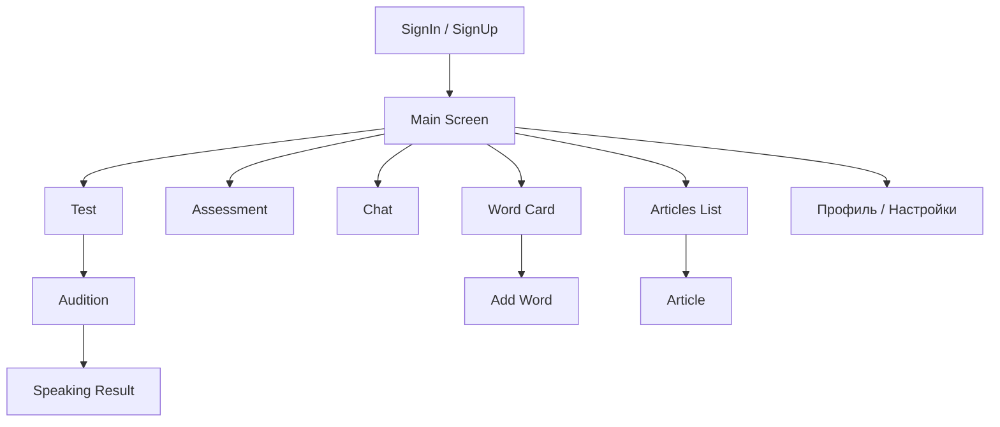
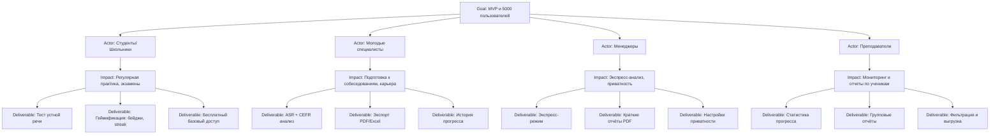
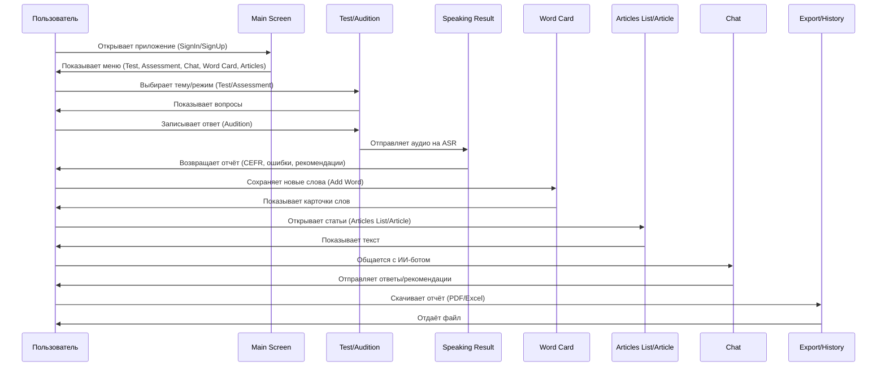
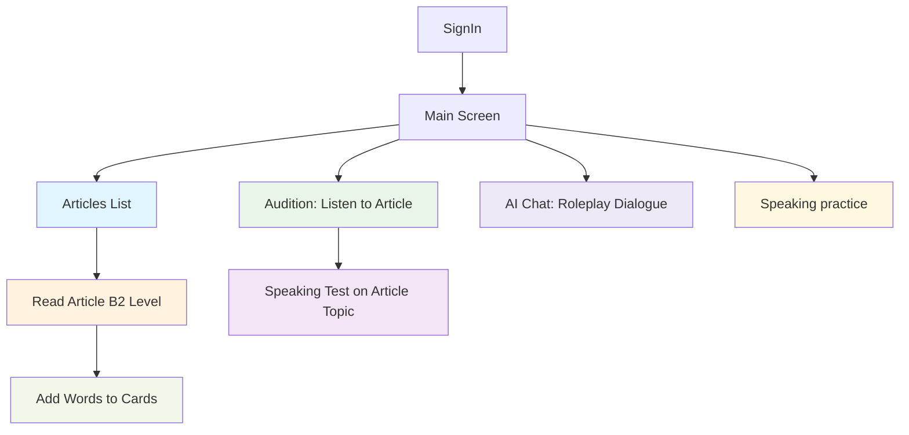
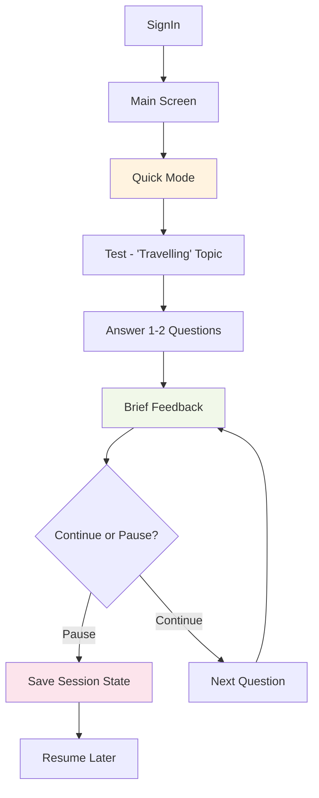
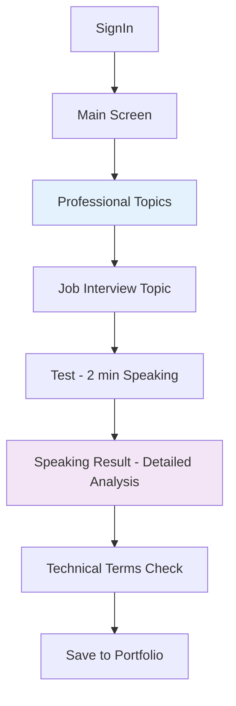
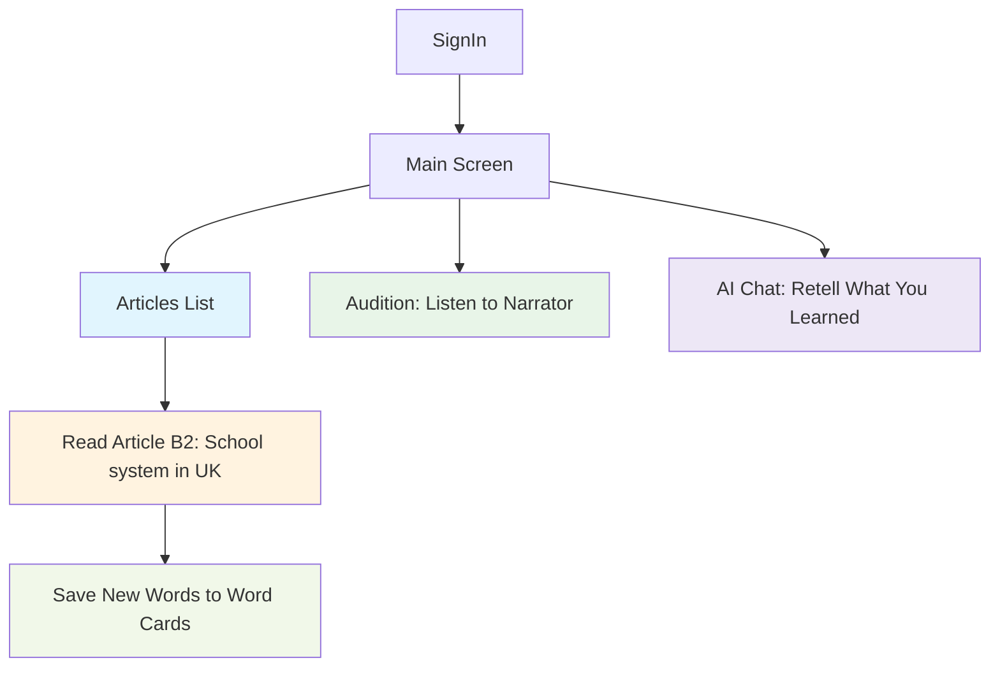
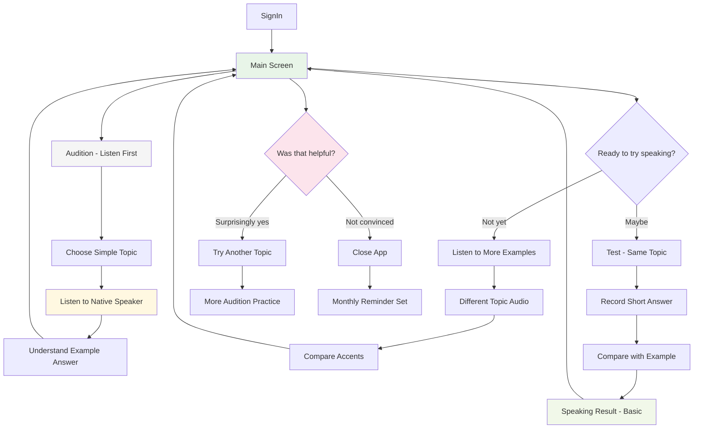

# Лабораторная работа 2

---

## Оглавление

1. [Постановка задачи](#постановка-задачи)  
2. [Стратегия дизайна](#стратегия-дизайна)  
3. [Профиль группы (профиль пользователя, среды и задач)](#профиль-группы-профиль-пользователя-среды-и-задач)  
4. [Проанализировать задачи и роли пользователей](#проанализировать-задачи-и-роли-пользователей)  
5. [Разработать объектную модель](#разработать-объектную-модель)  
6. [Разработать информационную архитектуру веб-приложения](#разработать-информационную-архитектуру-веб-приложения)  
   6.1. [Пример схемы карты сайта](#пример-схемы-карты-сайта)  
   - [Тип интерфейса приложения и способы управления](#тип-интерфейса-приложения-и-способы-управления)  
   
   6.2. [Пример карты сайта](#пример-карты-сайта)  
   - [Группировка (карточная сортировка)](#группировка-карточная-сортировка)  
   - [Словарь терминов](#словарь-терминов)  
7. [Разработать концептуальные макеты для мобильного и/или веб-приложения](#разработать-концептуальные-макеты-для-мобильного-иили-веб-приложения)  
8. [Разработать навигационную модель системы и общую диаграмму путей](#разработать-навигационную-модель-системы-и-общую-диаграмму-путей)  
9.  [Разработать карту пути клиента (Customer Journey Map) и карту влияния (Impact Map)](#разработать-карту-пути-клиента-customer-journey-map-и-карту-влияния-impact-map)  
   - [Customer Journey Map](#customer-journey-map)  
10. [Разработать интерактивные раскадровки и совокупную диаграмму взаимодействия](#разработать-интерактивные-раскадровки-и-совокупную-диаграмму-взаимодействия)  
11. [Разработать дизайн макеты для мобильного и веб-приложения](#разработать-дизайн-макеты-для-мобильного-и-веб-приложения)  
12. [Выходные документы](#выходные-документы)

---

## Постановка задачи
Необходимо разработать iOS-приложение, web-приложение и серверную часть.  
Основной функционал системы заключается в оценке уровня владения английским языком пользователя на основе его устных ответов в формате аудио.  

### 1. Выбор темы и списка вопросов
- Отображение доступных тем для оценки (например: путешествия, работа, хобби).  
- Генерация списка вопросов по выбранной теме.  

### 2. Запись и загрузка аудио-ответов
- Возможность записи голосового ответа прямо в iOS-приложении или web-клиенте.  
- Отправка аудио-файла на сервер для последующей обработки.  

### 3. Серверная обработка
- Обработка аудио с помощью сервиса распознавания речи (ASR).  
- Анализ текста для оценки уровня английского языка.  
- Формирование итогового отчета с результатами анализа.  

### 4. Результаты и статистика
- Отображение пользователю уровня владения английским (по шкале CEFR: A1–C2).  
- Отображение использованных пользователем слов с указанием их уровня сложности (A1–C2).  
- Вывод грамматических ошибок с исправлениями.  
- Предложение вариантов по перефразированию выражений для более естественного звучания.  
- Общее резюме ответа пользователя.  

---

## Стратегия дизайна

### 1. Заинтересованные стороны

**Пользователи (конечные клиенты):**  
- Студенты и школьники — подготовка к экзаменам, практика устной речи  
- Молодые специалисты и IT-профессионалы — подготовка к собеседованиям, карьерные цели  
- Опытные профессионалы/менеджеры — деловые коммуникации, экспресс-оценка речи  
- Путешественники/любители общения — практическая речь, офлайн-доступ  

**Преподаватели/коучи:** используют отчёты для работы с учениками  
**Заказчик/бизнес-сторона:** получение конкурентного продукта для образовательного рынка  
**Команда разработки:** создание iOS-, web-приложения и серверной части  

### 2. Видение продукта (задачи)

Приложение должно:  
- Предоставлять возможность пройти устный тест (выбор темы → генерация вопросов → запись и отправка аудио)  
- Обеспечивать автоматическую расшифровку речи (ASR) и анализ уровня английского по шкале CEFR (A1–C2)  
- Предоставлять отчёт о грамматических ошибках, словаре и рекомендациях по перефразированию  
- Хранить историю результатов и визуализировать прогресс  
- Поддерживать геймификацию для повышения вовлечённости  
- Позволять экспортировать отчёты (PDF/Excel) и интегрироваться с LMS  

### 3. Конфликты и противоречия

- Студенты и школьники: ожидают бесплатный функционал и геймификацию  
- Профессионалы и менеджеры: готовы платить, требуют точности, приватности и строгого интерфейса без «игровых» элементов  
- Преподаватели: нуждаются в отчётах по группам → возможный конфликт с приватностью студентов  
- Бизнес: стремится монетизировать через подписку → ограничивает бесплатный доступ, что может вызвать отток части аудитории  

### 4. Задачи бизнеса, маркетинга и брендинга

**Бизнес-задачи (верифицируемые):**  
- Вывести на рынок MVP в течение 6–8 месяцев  
- Достичь 5 000 активных пользователей в первый год  
- Конвертировать ≥10% пользователей в платную подписку  

**Маркетинг и брендинг:**  
- Позиционировать продукт как «инструмент экспресс-оценки речи» (в отличие от Duolingo или Memrise, акцентированных на лексике)  
- Подчеркнуть сочетание точности и простоты  
- Использовать образовательное сотрудничество (школы, университеты)  

### 5. Измеримые критерии успешности

- Точность ASR ≥ 85% в условиях умеренного шума  
- Время получения результата ≤ 5 сек на один ответ  
- Удержание пользователей: ≥ 40% через месяц использования  
- Рейтинг приложения ≥ 4,5 в App Store/Google Play  
- ≥ 70% пользователей отметят удобство интерфейса в опросе обратной связи  

### 6. Технические возможности и ограничения

**Технологии:**  
- iOS-приложение (Swift)  
- Web-клиент (Flutter, адаптивная верстка)  
- Серверная часть (Go)  
- Интеграция с сервисом ASR (Google Speech-to-Text / аналог)  
- База данных (PostgreSQL/MySQL)  

**Ограничения:**  
- Нестабильное интернет-соединение → предусмотреть офлайн-кэширование  
- Различные уровни качества микрофона → реализовать шумоподавление и подсказки пользователю  
- Поддержка нескольких форматов экспорта (PDF, Excel)  
- Требования по защите персональных данных (GDPR, локальное хранение)  

### 7. Представления заинтересованных лиц о пользователях (целевая аудитория)

**Primary:**  
- Студенты и школьники (A1–B2) — массовый сегмент, бесплатный доступ, геймификация  
- Молодые специалисты (B1–C1) — готовы платить за точность и экспорт отчётов  

**Secondary:**  
- Менеджеры (B1–C2) — ценят экспресс-режим, конфиденциальность  
- Преподаватели — используют систему для анализа и контроля групп  

**Niche:**  
- Продвинутые пользователи (C1–C2), преподаватели-экзаменаторы  

### 8. Бюджет и график проекта

**Бюджет (ориентировочно):**  
- Разработка MVP: по бутерброду на человека  
- Поддержка и серверные расходы (год): 100 USD  
- Маркетинг первого года: 100 USD  

**График проекта:**  
1. Этап 1 (1–2 мес): исследование, прототип, дизайн  
2. Этап 2 (3–4 мес): разработка ядра (тестирование речи, ASR, отчёты)  
3. Этап 3 (2 мес): интеграция, UX-доводка, бета-тест  
4. Этап 4 (1 мес): маркетинговый запуск MVP  
5. Этап 5 (после запуска): поддержка, добавление геймификации и экспортных функций  

---

## Профиль группы (профиль пользователя, среды и задач)

### Группа 1 — «Учебный сегмент» (Primary)
- **Состав:** школьники и студенты (A1–B2)  
- **Ключевые задачи:** подготовка к экзаменам, регулярная практика устной речи, получение подробной обратной связи  
- **Требования:** простой UI, геймификация, бесплатный базовый функционал; поддержка родительских отчётов (для несовершеннолетних)  

### Группа 2 — «Профессионалы / карьеристы» (Primary / Secondary)
- **Состав:** молодые специалисты и менеджеры (B1–C2)  
- **Ключевые задачи:** подготовка к собеседованиям, деловая речь, экспорт отчётов для работодателя/коуча  
- **Требования:** точность анализа, быстрый экспресс-режим, опции приватности, удобный экспорт (PDF)  

### Группа 3 — «Путешественники / практики общения» (Secondary)
- **Состав:** пользователи с целью общения и путешествий (все уровни)  
- **Ключевые задачи:** краткие практические сценарии (путешествия), офлайн-доступ к темам, устойчивость в шуме  
- **Требования:** короткие упражнения, офлайн-режим тем, адаптация к шуму  

### Группа 4 — «Продвинутые и тестовые пользователи» (Niche)
- **Состав:** пользователи C1–C2, преподаватели, экзаменаторы  
- **Ключевые задачи:** глубокий анализ стиля, детальная обратная связь, настройка критериев оценки  
- **Требования:** продвинутые отчёты, тонкие рекомендации, платные функции  

**Приоритизация продукта:**  
Сначала реализовать группы 1 и 2 (основной доход и наибольшая численность), далее — поддержка группы 3 и расширенные функции для группы 4.

---

## Проанализировать задачи и роли пользователей

### Категория 1 — Критические

| Задача | Ирина (студентка) | Дмитрий (IT-спец) | Мария (менеджер) | Саша (школьник) | Ольга (преподаватель) | Никита (скептик) |
|--------|-----------------|-----------------|-----------------|----------------|----------------------|-----------------|
| Проведение устного теста | ✔️ ключевая | ✔️ ключевая | ✔️ ключевая | ✔️ ключевая | ✔️ для учеников | ◯ пробует в демо |
| Запись и загрузка аудио | ✔️ ключевая | ✔️ ключевая | ✔️ ключевая | ✔️ ключевая | ◯ вторично | ◯ вызывает барьер |
| ASR-обработка и текстовая расшифровка | ✔️ важна | ✔️ критична | ✔️ критична | ✔️ важна | ✔️ для анализа ошибок | ◯ сомневается |
| Анализ и формирование отчёта | ✔️ важен | ✔️ ключевой | ✔️ ключевой | ✔️ в упрощённом виде | ✔️ групповой и индивид. | ◯ недоверие |

### Категория 2 — Важные

| Задача | Ирина (студентка) | Дмитрий (IT-спец) | Мария (менеджер) | Саша (школьник) | Ольга (преподаватель) | Никита (скептик) |
|--------|-----------------|-----------------|-----------------|----------------|----------------------|-----------------|
| История результатов и статистика прогресса | ✔️ важна | ✔️ важна | ✔️ нужна | ✔️ важна | ✔️ ключевая | ◯ малозначима |
| Визуализация прогресса | ✔️ мотивирует | ✔️ нужна | ✔️ нужна | ✔️ мотивирует | ✔️ важна | ◯ неинтересна |
| Экспорт результатов (PDF/Excel) | ◯ редко | ✔️ ключевой | ✔️ ключевой | ◯ не использует | ✔️ ключевой | ◯ не использует |
| Персонализированные рекомендации | ✔️ ожидает | ✔️ хочет | ✔️ критично | ✔️ важно | ✔️ для работы с учениками | ◯ без интереса |

### Категория 3 — Дополнительные

| Задача | Ирина (студентка) | Дмитрий (IT-спец) | Мария (менеджер) | Саша (школьник) | Ольга (преподаватель) | Никита (скептик) |
|--------|-----------------|-----------------|-----------------|----------------|----------------------|-----------------|
| Геймификация (бейджи, награды, челленджи) | ✔️ мотивирует | ◯ неважно | ◯ не нужна | ✔️ ключевая | ◯ не используется | ◯ не удерживает |
| Демонстрационный режим | ◯ редко | ◯ редко | ◯ редко | ◯ не нужен | ◯ не нужен | ✔️ ключевой |

---

## Разработать объектную модель

### 1. Объекты-данные

| Объект-данные | Мощность | Представления | Действия | Атрибуты |
|---------------|---------|---------------|----------|----------|
| Тема / Вопрос | десятки | список, детальное | выбрать, просмотреть | название темы, список вопросов, уровень сложности (A1–C2) |
| Аудио-ответ | тысячи | список, предпросмотр | записать, загрузить, прослушать, удалить | длительность, качество записи, формат |
| Текстовая расшифровка (ASR) | тысячи | текстовое поле, список | просмотреть, редактировать (опционально), сравнить с эталоном | текст, точность распознавания, ошибки |
| Отчёт анализа | тысячи | детальное, резюме | просмотреть, скачать, экспортировать | уровень CEFR, грамматические ошибки, список слов с уровнями, рекомендации |
| История результатов | сотни на пользователя | список, график | просмотреть, сравнить, удалить | дата, результат CEFR, прогресс |
| Словарь пользователя | сотни | список, аннотация | просмотреть, искать, добавить | слово, уровень CEFR, пометки, подсказки замены |
| Пользовательский профиль | сотни | карточка, список | создать, редактировать | возраст, уровень английского, цели, устройство |
| Группа пользователей | десятки | список | просмотреть | название группы, состав, ключевые задачи, требования |
| Персонаж (User persona) | несколько | описание | просмотреть | социальные характеристики, навыки, мотивация, среда |

### 2. Функциональные объекты

| Функциональный объект | Мощность | Представления | Действия | Атрибуты |
|----------------------|---------|---------------|----------|----------|
| Запись аудио | всегда доступна | кнопка, индикатор | начать, остановить, повторить | состояние (идёт запись / остановка), индикатор времени |
| Поиск / фильтр тем | десятки | строка поиска, фильтры | искать, отфильтровать | ключевые слова, уровень сложности |
| Анализ речи (ASR) | каждый ответ | процесс (прогресс-бар, статус) | запустить, обработать, завершить | состояние обработки, точность |
| Генератор рекомендаций | каждый тест | список, подсказки | показать варианты, переформулировать | тип рекомендации (лексика/грамматика/естественность) |
| Геймификация | для всех | баллы, достижения | начислить, просмотреть | очки, достижения, уровень |
| Социальные функции | опционально | чат, группа | отправить сообщение, вступить в клуб | тема чата, список участников |
| Экспорт отчётов | опционально | меню, список форматов | сохранить PDF, интегрировать в LMS | формат, дата экспорта |

### 3. Связи объектов

- **Основной цикл работы:**  
  `Тема / Вопрос → Аудио-ответ → Текст (ASR) → Отчёт анализа → История результатов`
- **Отчёт анализа → Словарь** (слова с уровнями CEFR)  
- **Пользовательский профиль → История результатов, Словарь** (привязка данных к пользователю)  
- **Группа пользователей → Персонажи → Профиль** (персонажи воплощают разные типы пользователей)  
- **Функциональные объекты обслуживают данные:**  
  - «Запись аудио» ↔ «Аудио-ответ»  
  - «Анализ речи» ↔ «Текст расшифровки»  
  - «Генератор рекомендаций» ↔ «Отчёт анализа»  
  - «Экспорт» ↔ «Отчёт анализа / История результатов»  

### 4. Соответствие объектов персонажам

| Персонаж | Основные объекты |
|-----------|----------------|
| Студент (A) | Проведение теста, Аудио-ответ, История результатов, Геймификация |
| Школьник (B) | Вопросы, Аудио-ответ, Отчёт анализа (с простыми подсказками), Геймификация, Родительский отчёт |
| Молодой специалист (C) | Аудио-ответ, Отчёт анализа (подробный, с экспортом), История, Словарь, Экспорт |
| Менеджер (D) | Экспресс-отчёт, Экспорт PDF, Анализ речи, Отчёт анализа (деловой режим) |

---

## Разработать информационную архитектуру веб-приложения

## 6. Разработать информационную архитектуру веб-приложения

### 6.1. Пример схемы карты сайта

#### Тип интерфейса приложения и способы управления

**Тип интерфейса:**
- Гибридное приложение (iOS + web). Основной интерфейс — мобильный (ориентирован на смартфон), с адаптацией для web.  
- Основной интерфейс: графический (GUI).  
- Дополнительный: голосовой интерфейс (Audition + Speaking test).  
- Элементы: карточки, списки, кнопки записи, прогресс-индикаторы, чат.  

**Способы управления:**
- Тач-навигация: свайпы, тапы, кнопки (мобильный).  
- Клавиатура + мышь (web).  
- Голосовой ввод (для Audition/Speaking).  
- Структура «одной руки» на iOS (крупные кнопки, минимальный текст).  
- Быстрые переходы между экранами через нижнее меню или боковую панель.  

### 6.2. Пример карты сайта

#### Список экранов
На основе списка экранов:
- **SignUp** — регистрация  
- **SignIn** — вход  
- **Main Screen** — домашний экран/дашборд  
- **Test** — тест (устный тест)  
- **Audition** — прослушивание голоса / проверка речи  
- **Speaking Result** — результаты речи (разбор)  
- **Assessment** — экзамен (речевая проверка с таймером)  
- **Word Card** — карточки слов  
- **Add Word** — добавить слово  
- **Article** — статья (текст на англ.)  
- **Articles List** — список статей  
- **Chat** — чат с ИИ (для тренировки диалогов)  

#### Группировка (карточная сортировка)

| Категория             | Экраны                                  |
|------------------------|------------------------------------------|
| Аутентификация         | SignUp, SignIn                          |
| Главная/дашборд        | Main Screen                             |
| Обучение и практика    | Test, Audition, Assessment, Chat        |
| Результаты и отчёты    | Speaking Result                         |
| Словарь и слова        | Word Card, Add Word                     |
| Материалы для чтения   | Articles List, Article                  |
| Прочее / профиль       | Настройки (будущая интеграция)          |

#### Словарь терминов

| Термин        | Определение |
|---------------|-------------|
| **ASR (Automatic Speech Recognition)** | Технология распознавания речи, которая переводит аудио в текст. |
| **CEFR** | Международная шкала уровней владения языком (A1–C2). |
| **Speaking Result** | Экран с результатами анализа речи, грамматикой, лексикой. |
| **Assessment** | Экзаменационный режим проверки речи. |
| **Word Card** | Карточки слов с переводом и уровнем сложности. |
| **Add Word** | Добавление слова в личный словарь. |
| **Articles List** | Список текстов для чтения. |
| **Audition** | Прослушивание собственной речи/образцов для сравнения. |
| **Chat** | Диалог с ИИ-ботом на английском. |
| **Main Screen** | Домашний экран с навигацией по основным функциям. |

#### Диаграмма навигации

---

## Разработать карту пути клиента (Customer Journey Map) и карту влияния (Impact Map)

### Customer Journey Map

### Impact Map

---

## Разработать интерактивные раскадровки и совокупную диаграмму взаимодействия

### Интерактивные раскадровки (ключевые сценарии)

Раскадровка — это последовательность «экран → действие → результат».

**Ирина (студентка) – Сценарий «Экзамен»**  
- Main Screen → нажимает «Test».  
- Test → выбирает тему «My Family».  
- Audition → слышит пример вопроса.  
- Record → отвечает голосом.  
- Speaking Result → видит ошибки, уровень CEFR, рекомендации.  

**Дмитрий (IT-специалист) – Сценарий «Подготовка к собеседованию»**  
- Main Screen → Assessment.  
- Assessment → выбирает «Job interview».  
- Audition → отвечает на вопросы.  
- Speaking Result → скачивает отчёт в PDF.  

**Мария (менеджер) – Сценарий «Экспресс-проверка»**  
- Main Screen → Assessment (Экспресс).  
- Assessment → быстрый тест из 2 вопросов.  
- Speaking Result → быстрый отчёт, сохраняет PDF.  

**Саша (школьник) – Сценарий «Геймификация»**  
- Main Screen → Test Challenge.  
- Test → выбирает тему «Travelling».  
- Audition → отвечает.  
- Speaking Result → видит баллы/ачивки.  

**Ольга (преподаватель) – Сценарий «Групповой отчёт»**  
- Web Main Screen → Dashboard.  
- History → выбирает класс.  
- Reports → экспортирует Excel.  

### Проверочные сценарии (чек-лист)

Проверочные сценарии нужны для тестирования «узких мест» продукта.  

- **Регистрация/Вход:** SignUp → SignIn (новый пользователь, забытый пароль).  
- **Основной поток:** Test → Audition → Speaking Result.  
- **Экзамен (Assessment):** таймер, повторная попытка, экспорт.  
- **Словарь:** Word Card → Add Word → поиск.  
- **Материалы:** Articles List → Article (чтение, поиск).  
- **Соц.функции:** Chat (отправка/получение сообщений).  
- **Разные среды:** мобильный интернет, шум, оффлайн-кэш тем.  

### Совокупная диаграмма взаимодействия

---

## Разработать навигационную модель системы и общую диаграмму путей

### Ирина — подготовка к экзамену

### Ирина — в дороге (Quick Mode)

### Дмитрий — подготовка к собеседованию

### Школьник — подготовка к экзамену

### Никита — быстрое знакомство со всеми функциями

### Общая диаграмма путей

```mermaid
flowchart TD
    %% Точка входа
    START([App Launch]) --> AUTH{Has Account?}
    AUTH -->|No| SIGNUP[SignUp]
    AUTH -->|Yes| SIGNIN[SignIn]
    SIGNUP --> ONBOARD[Quick Onboarding]
    ONBOARD --> MAIN[Main Screen]
    SIGNIN --> MAIN

    %% Главный хаб - центр всех переходов
    MAIN --> ARTICLES[Articles List]
    MAIN --> AUDITION[Audition - Listen First]
    MAIN --> TEST[Speaking Test/Practice]
    MAIN --> AICHAT[AI Chat]
    MAIN --> QUICKMODE[Quick Mode]
    MAIN --> PROFESSIONAL[Professional Topics]
    MAIN --> WORDCARDS[Word Cards]
    MAIN --> ASSESSMENT[Assessment/Exam Mode]
    MAIN --> PROFILE[Profile & Analytics]

    %% Пути от Articles List (Ирина, Школьник)
    ARTICLES --> READARTICLE[Read Article B2 Level]
    READARTICLE --> EXTRACTWORDS[Add Words to Cards]
    EXTRACTWORDS --> MAIN
    ARTICLES --> MAIN

    %% Пути от Audition (Никита, все для знакомства)
    AUDITION --> CHOOSETOPIC[Choose Simple Topic]
    CHOOSETOPIC --> LISTENEXAMPLE[Listen to Native Speaker]
    LISTENEXAMPLE --> UNDERSTAND[Understand Example Answer]
    UNDERSTAND --> MAIN
    AUDITION --> COMPARESOUNDS[Compare Accents]
    COMPARESOUNDS --> MAIN

    %% Пути от Speaking Test (все персонажи)
    TEST --> RECORD[Record Answer]
    RECORD --> RESULT[Speaking Result]
    RESULT --> ANALYSIS[Detailed Analysis]
    ANALYSIS --> MAIN
    RESULT --> QUICKFEEDBACK[Brief Feedback]
    QUICKFEEDBACK --> MAIN
    RESULT --> ADDWORDS[Add Difficult Words]
    ADDWORDS --> WORDCARDS

    %% Professional режимы (Дмитрий)
    PROFESSIONAL --> JOBINTERVIEW[Job Interview Topic]
    JOBINTERVIEW --> PROFTEST[Test - 2 min Speaking]
    PROFTEST --> PROFRESULT[Professional Analysis]
    PROFRESULT --> TECHTERMS[Technical Terms Check]
    TECHTERMS --> PORTFOLIO[Save to Portfolio]
    PORTFOLIO --> MAIN
    PROFRESULT --> MAIN

    %% Quick Mode (Ирина в дороге)
    QUICKMODE --> QUICKTEST[Quick Test - 1-2 Questions]
    QUICKTEST --> QUICKRESULT[Brief Feedback]
    QUICKRESULT --> CONTINUE{Continue or Pause?}
    CONTINUE -->|Continue| NEXTQUICK[Next Quick Question]
    CONTINUE -->|Pause| SAVESTATE[Save Session State]
    CONTINUE -->|Switch| MAIN
    NEXTQUICK --> QUICKRESULT
    SAVESTATE --> RESUME[Resume Later]

    %% AI Chat пути
    AICHAT --> DIALOGUE[Start Roleplay Dialogue]
    DIALOGUE --> CHATRESULT[Conversation Analysis]
    CHATRESULT --> MAIN
    AICHAT --> RETELL[Retell What You Learned]
    RETELL --> MAIN

    %% Assessment/Exam режимы (Школьник)
    ASSESSMENT --> EXAMMODE[ЕГЭ/TOEFL Practice]
    EXAMMODE --> TIMEDTEST[Timed Assessment]
    TIMEDTEST --> EXAMRESULT[Exam-style Results]
    EXAMRESULT --> COMPARE[Compare with Standards]
    COMPARE --> BADGES[Achievement Badges]
    BADGES --> MAIN
    EXAMRESULT --> MAIN

    %% Word Cards система
    WORDCARDS --> STUDYCARDS[Study Session]
    STUDYCARDS --> PRACTICE[Pronunciation Practice]
    PRACTICE --> MAIN
    WORDCARDS --> ADDNEW[Add New Words]
    ADDNEW --> MAIN

    %% Profile & Analytics
    PROFILE --> STATS[Statistics Dashboard]
    PROFILE --> ACHIEVEMENTS[Achievement Gallery]
    PROFILE --> EXPORT[Export Reports]
    STATS --> MAIN
    ACHIEVEMENTS --> SHARE[Share Progress]
    SHARE --> MAIN
    EXPORT --> MAIN

    %% Exit points
    MAIN --> EXIT[Save & Exit]
    MAIN --> REMINDER[Set Reminders]

    %% Styling для лучшей читаемости
    style MAIN fill:#e8f5e8,stroke:#2e7d32,stroke-width:3px
    style SIGNUP fill:#ffcdd2
    style SIGNIN fill:#ffcdd2
    style TEST fill:#e3f2fd
    style PROFESSIONAL fill:#f3e5f5
    style QUICKMODE fill:#fff3e0
    style ARTICLES fill:#e1f5fe
    style AUDITION fill:#f5f5f5
    style AICHAT fill:#ede7f6
    style ASSESSMENT fill:#ffebee
    style RESULT fill:#f1f8e9
```

---