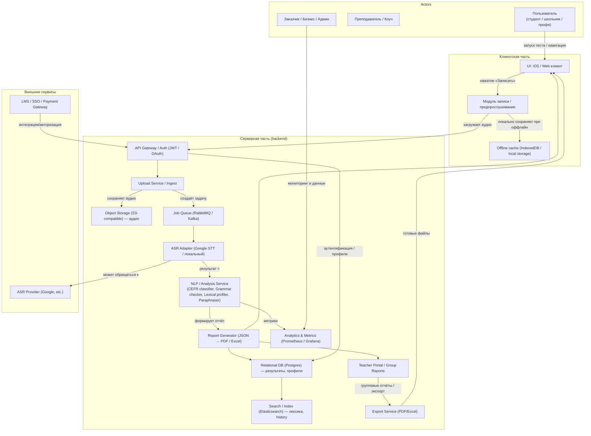
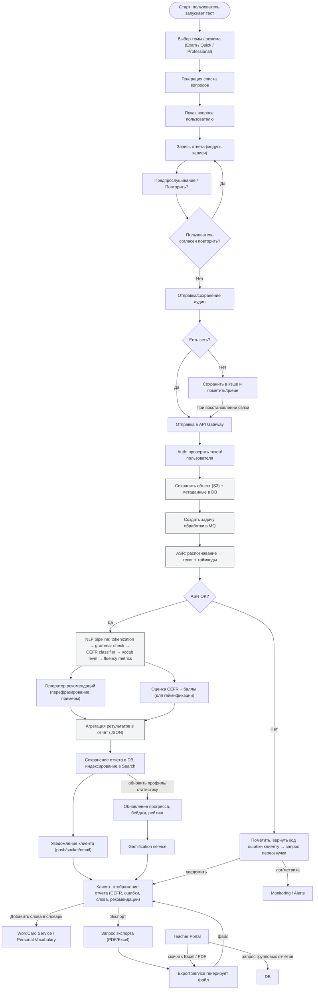
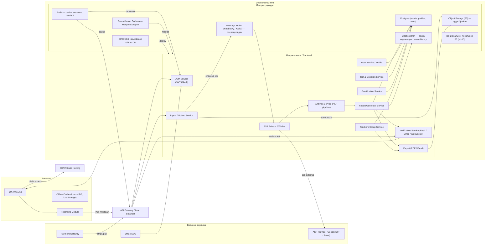
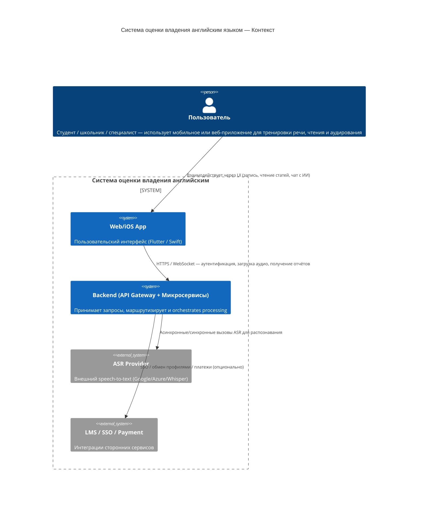
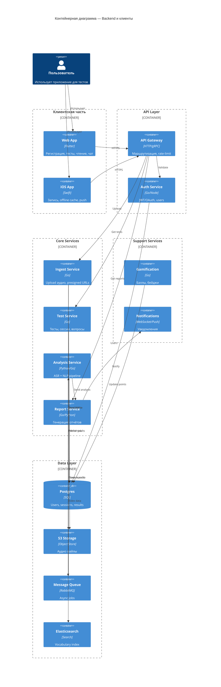
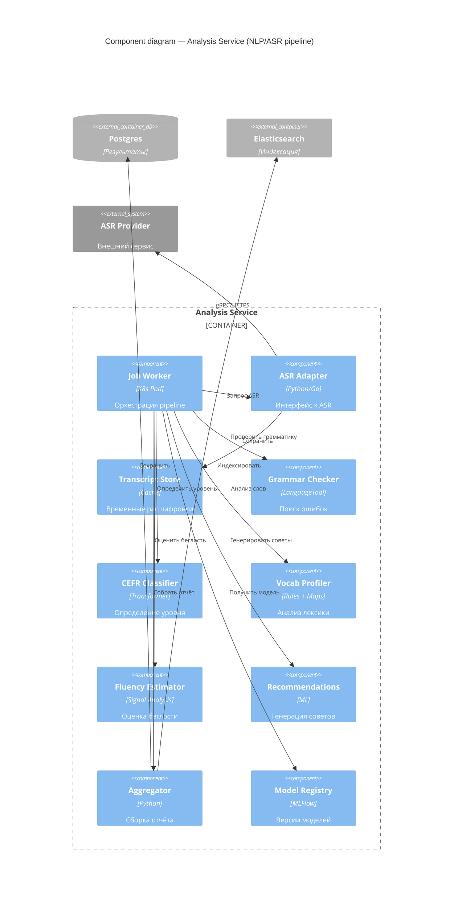
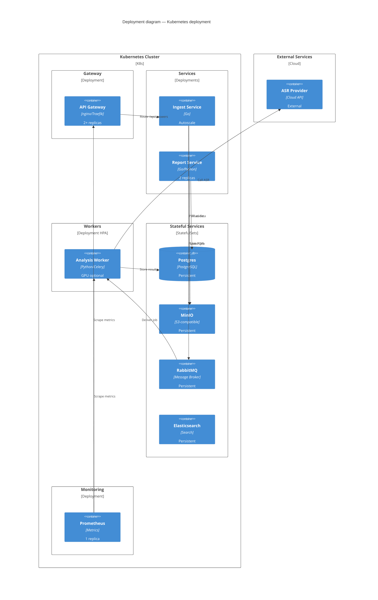
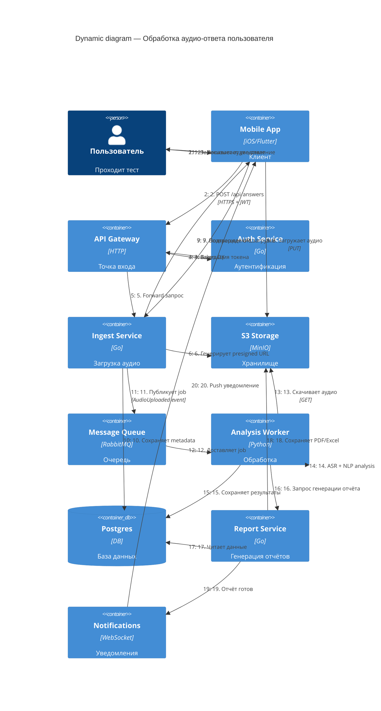

# Лабораторная работа 3

---
 
## Оглавление
- [Лабораторная работа 3](#лабораторная-работа-3)
  - [Оглавление](#оглавление)
  - [Задание 1. Разработка спецификации системы с использованием PlanUML](#задание-1-разработка-спецификации-системы-с-использованием-planuml)
    - [диаграммы вариантов использования](#диаграммы-вариантов-использования)
    - [Сценарии вариантов использования](#сценарии-вариантов-использования)
    - [Диаграммы деятельности (2-3) на языке PlantUML](#диаграммы-деятельности-2-3-на-языке-plantuml)
      - [Диаграмма 1: Процесс оценки устной речи пользователя](#диаграмма-1-процесс-оценки-устной-речи-пользователя)
      - [Диаграмма 2: Процесс работы со статьей и анализа лексики](#диаграмма-2-процесс-работы-со-статьей-и-анализа-лексики)
      - [Диаграмма 3: Процесс регистрации и первого входа](#диаграмма-3-процесс-регистрации-и-первого-входа)
    - [Диаграммы классов и объектов (не менее 5) на языке PlantUML,](#диаграммы-классов-и-объектов-не-менее-5-на-языке-plantuml)
      - [1. Диаграмма классов: Основная доменная модель](#1-диаграмма-классов-основная-доменная-модель)
      - [2.Диаграмма классов: Система геймификации](#2диаграмма-классов-система-геймификации)
      - [Диаграмма классов: Модуль аудирования](#диаграмма-классов-модуль-аудирования)
      - [Диаграмма классов: Модуль AI-чата](#диаграмма-классов-модуль-ai-чата)
    - [Диаграммы последовательности на языке PlantUML,](#диаграммы-последовательности-на-языке-plantuml)
      - [1. Диаграмма последовательности: Получение отчета после устного ответа](#1-диаграмма-последовательности-получение-отчета-после-устного-ответа)
      - [2. Диаграмма последовательности: Регистрация нового пользователя](#2-диаграмма-последовательности-регистрация-нового-пользователя)
      - [Диаграмма последовательности: Взаимодействие с AI-чатом](#диаграмма-последовательности-взаимодействие-с-ai-чатом)
      - [Диаграмма последовательности: Добавление слова в личный словарь](#диаграмма-последовательности-добавление-слова-в-личный-словарь)
    - [Диаграммы компонентов на языке PlantUML](#диаграммы-компонентов-на-языке-plantuml)
    - [Диаграмма пакетов](#диаграмма-пакетов)
    - [Диаграмма развертывания](#диаграмма-развертывания)
    - [схема/ы базы данных, используя диаграммы «сущность-связь» (Entity RelationShip Diagram — ERD)](#схемаы-базы-данных-используя-диаграммы-сущность-связь-entity-relationship-diagram--erd)
  - [Задание 2. Проектирование системы на основе метода EventStorming](#задание-2-проектирование-системы-на-основе-метода-eventstorming)
    - [1) Big Picture — общая концепция (акторы, основные потоки)](#1-big-picture--общая-концепция-акторы-основные-потоки)
    - [2) Process Modeling — детальный бизнес-процесс (шаги, ветвления, ошибки)](#2-process-modeling--детальный-бизнес-процесс-шаги-ветвления-ошибки)
    - [3) Software Design — архитектура (модули, инфраструктура, интеграции, очереди)](#3-software-design--архитектура-модули-инфраструктура-интеграции-очереди)
  - [Задание 3. Проектирование системы с применением метода Event Modeling](#задание-3-проектирование-системы-с-применением-метода-event-modeling)
    - [Sign In](#sign-in)
    - [Выбор темы для аудио ответов](#выбор-темы-для-аудио-ответов)
    - [Запись и загрузка аудио-ответов](#запись-и-загрузка-аудио-ответов)
    - [Общение с AI чатом](#общение-с-ai-чатом)
    - [Чтение статьи](#чтение-статьи)
    - [Пройти тест по грамматике](#пройти-тест-по-грамматике)
    - [Пройти тест по грамматике расширенная](#пройти-тест-по-грамматике-расширенная)
    - [Повторение слов по карточкам](#повторение-слов-по-карточкам)
    - [Прослушивание подкастов](#прослушивание-подкастов)
    - [Прослушивание подкастов расширенная](#прослушивание-подкастов-расширенная)
  - [Задание 4. Описание архитектуры системы с использованием подхода C4 Model](#задание-4-описание-архитектуры-системы-с-использованием-подхода-c4-model)
    - [1) System Context](#1-system-context)
    - [2) Container diagram](#2-container-diagram)
    - [3) Component diagram](#3-component-diagram)
    - [4) Deployment diagram](#4-deployment-diagram)
    - [5) Dynamic diagram](#5-dynamic-diagram)

---

## Задание 1. Разработка спецификации системы с использованием PlanUML

### диаграммы вариантов использования

### Сценарии вариантов использования

### Диаграммы деятельности (2-3) на языке PlantUML

#### Диаграмма 1: Процесс оценки устной речи пользователя

#### Диаграмма 2: Процесс работы со статьей и анализа лексики

#### Диаграмма 3: Процесс регистрации и первого входа

### Диаграммы классов и объектов (не менее 5) на языке PlantUML,

#### 1. Диаграмма классов: Основная доменная модель

#### 2.Диаграмма классов: Система геймификации

#### Диаграмма классов: Модуль аудирования

#### Диаграмма классов: Модуль AI-чата

### Диаграммы последовательности на языке PlantUML,

#### 1. Диаграмма последовательности: Получение отчета после устного ответа

#### 2. Диаграмма последовательности: Регистрация нового пользователя

#### Диаграмма последовательности: Взаимодействие с AI-чатом

#### Диаграмма последовательности: Добавление слова в личный словарь

### Диаграммы компонентов на языке PlantUML

### Диаграмма пакетов

### Диаграмма развертывания

### схема/ы базы данных, используя диаграммы «сущность-связь» (Entity RelationShip Diagram — ERD)

## Задание 2. Проектирование системы на основе метода EventStorming

### 1) Big Picture — общая концепция (акторы, основные потоки)

Эта схема показывает главных участников системы (пользователь, преподаватель, бизнес), клиентскую часть и серверную подсистему: загрузка аудио → очередь задач → ASR → аналитика → генерация отчёта → возврат пользователю и сохранение в БД. Включены внешние интеграции (ASR-провайдер, LMS) и подсистема аналитики.

### 2) Process Modeling — детальный бизнес-процесс (шаги, ветвления, ошибки)

Пошаговый бизнес-процесс от выбора темы до получения отчёта: запись → (локальное сохранение при оффлайн) → загрузка → очередь обработки → ASR → NLP-pipeline (CEFR, грамматика, лексика) → генерация отчёта → уведомление и отображение. Включены ветвления на ошибки ASR, оффлайн-сценарий, сохранение прогресса и экспорт/учительские сценарии.

### 3) Software Design — архитектура (модули, инфраструктура, интеграции, очереди)

Архитектура разбита на клиентскую часть, граничный слой (CDN, API Gateway), набор микросервисов (аутентификация, ingest, ASR-адаптер, analysis, report, export, teacher, gamification), очередь задач и хранилища (S3, Postgres, Redis, Elastic). Внешние интеграции: ASR-провайдер, LMS и платёжная система. CI/CD + метрики вынесены в инфрастуктуру.

## Задание 3. Проектирование системы с применением метода Event Modeling

### Sign In

### Выбор темы для аудио ответов

### Запись и загрузка аудио-ответов

### Общение с AI чатом

### Чтение статьи

### Пройти тест по грамматике

### Пройти тест по грамматике расширенная

### Повторение слов по карточкам

### Прослушивание подкастов

### Прослушивание подкастов расширенная

## Задание 4. Описание архитектуры системы с использованием подхода C4 Model

### 1) System Context

Dнешние акторы - пользователь; 
Внешние системы - ASR и LMS; 
Наша система - UI + backend микросервисы, которые принимают аудио, обрабатывают и возвращают отчёт.

### 2) Container diagram

Контейнерная диаграмма выделяет отдельные микросервисы и хранилища. Очередь (mq) — ключевой элемент для асинхронного, масштабируемого анализа.

### 3) Component diagram

логика -  job_worker оркеструет пайплайн: ASR → Transcript → grammar/CEFR/vocab/fluency → recommendations → агрегатор.

### 4) Deployment diagram

### 5) Dynamic diagram

