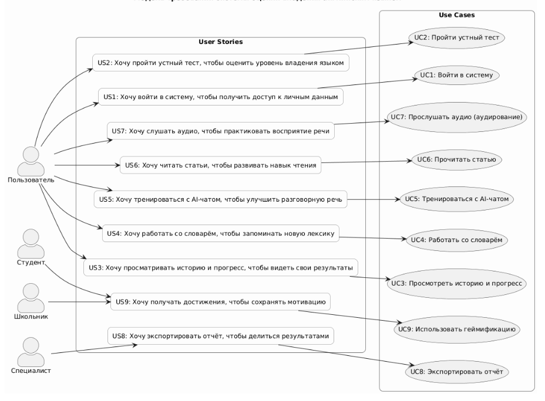
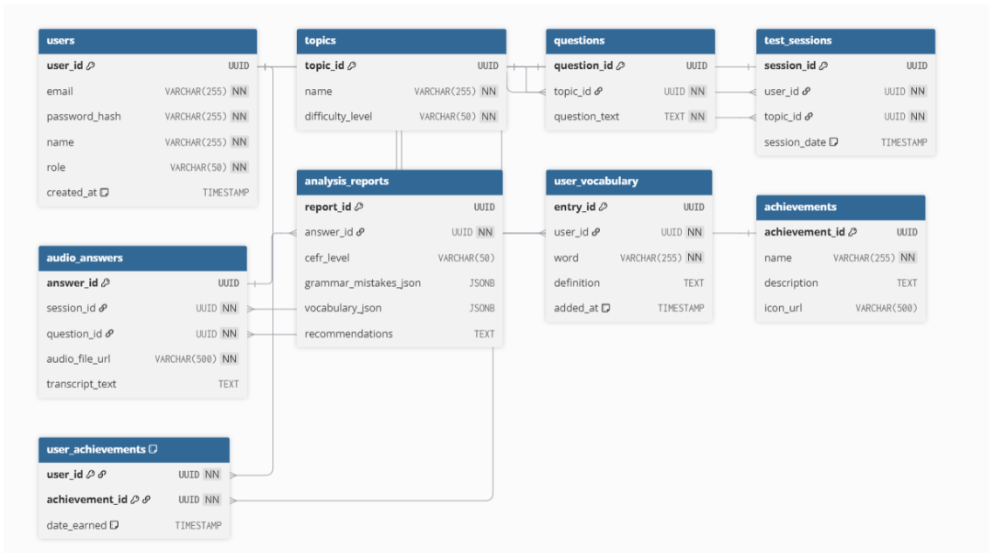
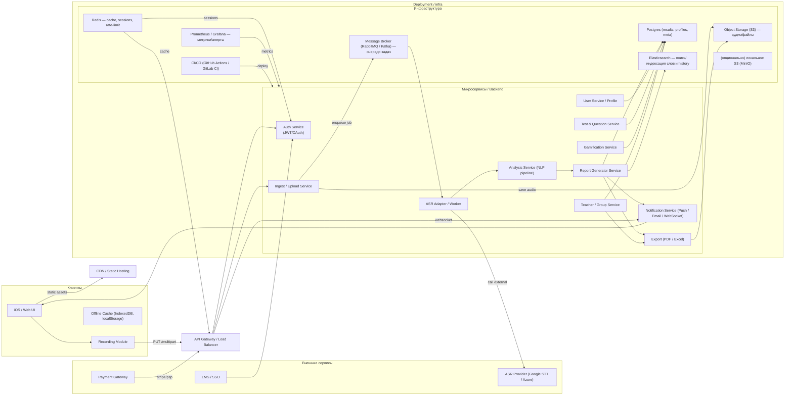

# Лабораторная работа 4
 
---

## Оглавление
- [Лабораторная работа 4](#лабораторная-работа-4)
  - [Оглавление](#оглавление)
  - [Задание 1. Проектирование модели требований и реестра вариантов использования](#задание-1-проектирование-модели-требований-и-реестра-вариантов-использования)
  - [Задание 2. Проектирование физической модели базы данных](#задание-2-проектирование-физической-модели-базы-данных)
  - [Задание 3. Проектирование маршрутов и конечных точек в виде спецификации API](#задание-3-проектирование-маршрутов-и-конечных-точек-в-виде-спецификации-api)
  - [Задание 4. Проектирование и тестирование API](#задание-4-проектирование-и-тестирование-api)
  - [Задание 5. Спроектировать инфраструктуру проекта и развернуть ее](#задание-5-спроектировать-инфраструктуру-проекта-и-развернуть-ее)
    - [1. Создать структуру проекта](#1-создать-структуру-проекта)
      - [Репозитории проекта](#репозитории-проекта)
      - [Принятая стратегия ветвления](#принятая-стратегия-ветвления)
    - [2. Управление проектом вести с использованием Project в github](#2-управление-проектом-вести-с-использованием-project-в-github)
      - [Структура доски управления задачами:](#структура-доски-управления-задачами)
    - [3. План работ](#3-план-работ)
      - [МИЛЕСТОУН 0 — Подготовка (repo, ветки, согласование)](#милестоун-0--подготовка-repo-ветки-согласование)
      - [МИЛЕСТОУН 1 — Базовый бэкенд и БД](#милестоун-1--базовый-бэкенд-и-бд)
      - [МИЛЕСТОУН 2 — Аутентификация, сессии, безопасность](#милестоун-2--аутентификация-сессии-безопасность)
      - [МИЛЕСТОУН 3 — Тестовые сценарии и анализ аудио](#милестоун-3--тестовые-сценарии-и-анализ-аудио)
      - [МИЛЕСТОУН 4 — OpenAPI, Mock, интеграция с фронтом](#милестоун-4--openapi-mock-интеграция-с-фронтом)
      - [МИЛЕСТОУН 5 — CI / тестирование / качество кода](#милестоун-5--ci--тестирование--качество-кода)
      - [МИЛЕСТОУН 6 — Контейнеризация и локальное окружение](#милестоун-6--контейнеризация-и-локальное-окружение)
      - [МИЛЕСТОУН 7 — Деплой (staging → production)](#милестоун-7--деплой-staging--production)
      - [МИЛЕСТОУН 8 — Финализация API (анализ, экспорт, чат, прогресс)](#милестоун-8--финализация-api-анализ-экспорт-чат-прогресс)
      - [МИЛЕСТОУН 9 — Документация, отчёт, handover](#милестоун-9--документация-отчёт-handover)
      - [РАСПРЕДЕЛЕНИЕ РОЛЕЙ](#распределение-ролей)
        - [Backend](#backend)
        - [DevOps](#devops)
        - [Front1](#front1)
        - [Front2](#front2)
        - [Code review / cross checks](#code-review--cross-checks)
    - [4. Добавить автоматические тесты](#4-добавить-автоматические-тесты)
    - [5. Спроектировать инфраструктуру бекенд и веб-приложения](#5-спроектировать-инфраструктуру-бекенд-и-веб-приложения)
    - [6. Развернуть инфраструктуру для бекенд, веб-приложения](#6-развернуть-инфраструктуру-для-бекенд-веб-приложения)
    - [7. Настроить сервис для проверки качества кода](#7-настроить-сервис-для-проверки-качества-кода)
    - [8. Обеспечить развертывание проекта (бекенд) из контейнеров Docker после прохождения тестов и проверки качества кода](#8-обеспечить-развертывание-проекта-бекенд-из-контейнеров-docker-после-прохождения-тестов-и-проверки-качества-кода)

---

## Задание 1. Проектирование модели требований и реестра вариантов использования

1. Модель требований (Actor → User Story → Use Case)

| Актор | User Story (пользовательская история) | Use Case (вариант использования) |
|-------|----------------------------------------|-----------------------------------|
| Пользователь | Как пользователь, я хочу войти в систему, чтобы получить доступ к своим данным | Войти в систему |
| Пользователь | Как пользователь, я хочу пройти устный тест, чтобы улучшить свои навыки говорения | Пройти устный тест |
| Пользователь | Как пользователь, я хочу видеть историю и прогресс, чтобы отслеживать свои успехи | Просмотреть историю и прогресс |
| Пользователь | Как пользователь, я хочу добавлять и изучать слова, чтобы пополнять словарный запас | Работать со словарем |
| Пользователь | Как пользователь, я хочу общаться с AI-чатом, чтобы тренировать разговорную речь | Тренироваться с AI-чатом |
| Пользователь | Как пользователь, я хочу читать статьи, чтобы развивать навык чтения | Прочитать статью |
| Пользователь | Как пользователь, я хочу слушать аудио, чтобы улучшать аудирование | Прослушать аудио (аудирование) |
| Специалист | Как специалист, я хочу экспортировать отчёт, чтобы сохранить результаты тестов | Экспортировать отчёт |
| Студент / Школьник | Как обучающийся, я хочу получать достижения, чтобы повышать мотивацию | Использовать геймификацию |


2. Реестр вариантов использования

| № | Название Use Case | Акторы | Предусловие | Основной поток | Постусловие |
|---|-------------------|--------|--------------|----------------|-------------|
| 1 | Войти в систему | Пользователь | Находится на экране входа | Ввод логина/пароля → проверка → вход | Сессия активна |
| 2 | Пройти устный тест | Пользователь | Авторизован | Выбор темы → запись → анализ → отчёт | Результат сохранён |
| 3 | Просмотреть историю и прогресс | Пользователь | Авторизован, есть тесты | Запрос истории → отображение графика | История просмотрена |
| 4 | Работать со словарем | Пользователь | Авторизован | Добавление слова → сохранение | Слово добавлено |
| 5 | Тренироваться с AI-чатом | Пользователь | Авторизован | Ввод реплики → ответ AI | Диалог завершён |
| 6 | Прочитать статью | Пользователь | Авторизован | Открытие статьи → чтение → анализ лексики | Прочитано |
| 7 | Прослушать аудио | Пользователь | Авторизован | Выбор трека → прослушивание → анализ | Завершено |
| 8 | Экспортировать отчёт | Специалист | Авторизован | Выбор отчёта → экспорт в PDF | Отчёт скачан |
| 9 | Использовать геймификацию | Студент / Школьник | Авторизован | Выполнение заданий → начисление баллов | Достижение получено |

3. Диаграмма модели требований (PlantUML)



---

## Задание 2. Проектирование физической модели базы данных

<table>
<tr>
<th>Сущность</th>
<th>Таблица БД</th>
<th>Поле</th>
<th>Смысл поля</th>
<th>Тип данных</th>
</tr>
<tr>
<td rowspan="6">Пользователь</td>
<td rowspan="6">users</td>
<td>user_id</td>
<td>уникальный идентификатор пользователя</td>
<td>UUID</td>
</tr>
<tr>
<td>email</td>
<td>электронная почта пользователя (уникальная)</td>
<td>VARCHAR(255)</td>
</tr>
<tr>
<td>password_hash</td>
<td>хэш пароля пользователя</td>
<td>VARCHAR(255)</td>
</tr>
<tr>
<td>name</td>
<td>имя пользователя</td>
<td>VARCHAR(255)</td>
</tr>
<tr>
<td>role</td>
<td>роль (student, specialist, schoolboy)</td>
<td>VARCHAR(50)</td>
</tr>
<tr>
<td>created_at</td>
<td>дата и время регистрации</td>
<td>TIMESTAMP</td>
</tr>
<tr>
<td rowspan="3">Тема теста</td>
<td rowspan="3">topics</td>
<td>topic_id</td>
<td>уникальный идентификатор темы</td>
<td>UUID</td>
</tr>
<tr>
<td>name</td>
<td>название темы</td>
<td>VARCHAR(255)</td>
</tr>
<tr>
<td>difficulty_level</td>
<td>уровень сложности темы</td>
<td>VARCHAR(50)</td>
</tr>
<tr>
<td rowspan="3">Вопрос</td>
<td rowspan="3">questions</td>
<td>question_id</td>
<td>уникальный идентификатор вопроса</td>
<td>UUID</td>
</tr>
<tr>
<td>topic_id</td>
<td>ссылка на тему (внешний ключ)</td>
<td>UUID</td>
</tr>
<tr>
<td>question_text</td>
<td>текст вопроса</td>
<td>TEXT</td>
</tr>
<tr>
<td rowspan="4">Сессия теста</td>
<td rowspan="4">test_sessions</td>
<td>session_id</td>
<td>уникальный идентификатор тестовой сессии</td>
<td>UUID</td>
</tr>
<tr>
<td>user_id</td>
<td>ссылка на пользователя, проходящего тест</td>
<td>UUID</td>
</tr>
<tr>
<td>topic_id</td>
<td>ссылка на тему теста</td>
<td>UUID</td>
</tr>
<tr>
<td>session_date</td>
<td>дата и время прохождения теста</td>
<td>TIMESTAMP</td>
</tr>
<tr>
<td rowspan="5">Аудиоответ</td>
<td rowspan="5">audio_answers</td>
<td>answer_id</td>
<td>уникальный идентификатор аудиоответа</td>
<td>UUID</td>
</tr>
<tr>
<td>session_id</td>
<td>ссылка на сессию теста</td>
<td>UUID</td>
</tr>
<tr>
<td>question_id</td>
<td>ссылка на вопрос</td>
<td>UUID</td>
</tr>
<tr>
<td>audio_file_url</td>
<td>путь к аудиофайлу</td>
<td>VARCHAR(500)</td>
</tr>
<tr>
<td>transcript_text</td>
<td>расшифровка речи (текст)</td>
<td>TEXT</td>
</tr>
<tr>
<td rowspan="6">Отчёт анализа</td>
<td rowspan="6">analysis_reports</td>
<td>report_id</td>
<td>уникальный идентификатор отчёта</td>
<td>UUID</td>
</tr>
<tr>
<td>answer_id</td>
<td>ссылка на аудиоответ (1:1)</td>
<td>UUID</td>
</tr>
<tr>
<td>cefr_level</td>
<td>уровень CEFR (A1–C2)</td>
<td>VARCHAR(50)</td>
</tr>
<tr>
<td>grammar_mistakes_json</td>
<td>JSON с найденными грамматическими ошибками</td>
<td>JSONB</td>
</tr>
<tr>
<td>vocabulary_json</td>
<td>JSON с анализом словаря</td>
<td>JSONB</td>
</tr>
<tr>
<td>recommendations</td>
<td>текстовые рекомендации</td>
<td>TEXT</td>
</tr>
<tr>
<td rowspan="5">Личный словарь</td>
<td rowspan="5">user_vocabulary</td>
<td>entry_id</td>
<td>уникальный идентификатор записи словаря</td>
<td>UUID</td>
</tr>
<tr>
<td>user_id</td>
<td>ссылка на пользователя</td>
<td>UUID</td>
</tr>
<tr>
<td>word</td>
<td>слово</td>
<td>VARCHAR(255)</td>
</tr>
<tr>
<td>definition</td>
<td>определение или перевод слова</td>
<td>TEXT</td>
</tr>
<tr>
<td>added_at</td>
<td>дата добавления слова</td>
<td>TIMESTAMP</td>
</tr>
<tr>
<td rowspan="4">Достижение</td>
<td rowspan="4">achievements</td>
<td>achievement_id</td>
<td>уникальный идентификатор достижения</td>
<td>UUID</td>
</tr>
<tr>
<td>name</td>
<td>название достижения</td>
<td>VARCHAR(255)</td>
</tr>
<tr>
<td>description</td>
<td>описание достижения</td>
<td>TEXT</td>
</tr>
<tr>
<td>icon_url</td>
<td>ссылка на иконку</td>
<td>VARCHAR(500)</td>
</tr>
<tr>
<td rowspan="3">Достижение пользователя</td>
<td rowspan="3">user_achievements</td>
<td>user_id</td>
<td>ссылка на пользователя</td>
<td>UUID</td>
</tr>
<tr>
<td>achievement_id</td>
<td>ссылка на достижение</td>
<td>UUID</td>
</tr>
<tr>
<td>date_earned</td>
<td>дата получения достижения</td>
<td>TIMESTAMP</td>
</tr>
</table>



---

## Задание 3. Проектирование маршрутов и конечных точек в виде спецификации API

| Сущность                | Таблица БД        | Маршрут            |
| ----------------------- | ----------------- | ------------------ |
| Пользователь            | users             | /users             |
| Аутентификация          | users             | /login             |
| Регистрация             | users             | /registration      |
| Тема теста              | topics            | /topics            |
| Вопрос                  | questions         | /questions         |
| Сессия теста            | test_sessions     | /test-sessions     |
| Аудиоответ              | audio_answers     | /audio-answers     |
| Отчёт анализа           | analysis_reports  | /analysis-reports  |
| Личный словарь          | user_vocabulary   | /vocabulary        |
| Достижение              | achievements      | /achievements      |
| Достижение пользователя | user_achievements | /user-achievements |
| Экспорт отчёта          | analysis_reports  | /export-report     |
| AI-чат                  | —                 | /chat              |
| Статья                  | —                 | /articles          |
| Аудио для прослушивания | —                 | /audio             |


| Актор              | Use Case                                | Маршрут                       | HTTP-запрос | Аутентификация |
| ------------------ | --------------------------------------- | ----------------------------- | ----------- | -------------- |
| Пользователь       | UC 1.1 Войти в систему                  | /login                        | POST        | нет            |
| Пользователь       | UC 1.2 Регистрация                      | /registration                 | POST        | нет            |
| Пользователь       | UC 2.1 Получить список тем              | /topics                       | GET         | да             |
| Пользователь       | UC 2.2 Получить вопросы по теме         | /questions?topic_id={id}      | GET         | да             |
| Пользователь       | UC 2.3 Создать сессию теста             | /test-sessions                | POST        | да             |
| Пользователь       | UC 2.4 Отправить аудиоответ             | /audio-answers                | POST        | да             |
| Пользователь       | UC 2.5 Получить отчёт анализа           | /analysis-reports/{answer_id} | GET         | да             |
| Пользователь       | UC 3 Просмотреть историю и прогресс     | /progress                     | GET         | да             |
| Пользователь       | UC 4.1 Получить слова словаря           | /vocabulary                   | GET         | да             |
| Пользователь       | UC 4.2 Добавить слово в словарь         | /vocabulary                   | POST        | да             |
| Пользователь       | UC 4.3 Удалить слово из словаря         | /vocabulary                   | DELETE      | да             |
| Пользователь       | UC 5.1 Создать сессию с AI чатом        | /chat/start                   | POST        | да             |
| Пользователь       | UC 5.2 Отправить сообщение AI-чату      | /chat/message                 | POST        | да             |
| Пользователь       | UC 5.3 Получить ответ AI                | /chat/message/{id}            | GET         | да             |
| Пользователь       | UC 5.4 Получить историю диалога         | /chat/history                 | GET         | да             |
| Пользователь       | UC 5.5 Завершить текущую сессию диалога | /chat/end                     | POST        | да             |
| Пользователь       | UC 6.1 Получить список статей           | /articles                     | GET         | да             |
| Пользователь       | UC 6.2 Прочитать статью                 | /articles/{id}                | GET         | да             |
| Пользователь       | UC 7.1 Получить список аудио            | /audio                        | GET         | да             |
| Пользователь       | UC 7.2 Прослушать аудио                 | /audio/{id}                   | GET         | да             |
| Специалист         | UC 8.1 Получить отчёты                  | /analysis-reports             | GET         | да             |
| Специалист         | UC 8.2 Экспортировать отчёт в PDF       | /export-report/{report_id}    | GET         | да             |
| Студент / Школьник | UC 9.1 Получить достижения              | /user_achievements            | GET         | да             |

---

## Задание 4. Проектирование и тестирование API

# API Документация - Система изучения языка и тестирования

## Оглавление

- [Введение](#введение)
- [Базовые URL](#базовые-url)
- [Аутентификация](#аутентификация)
- [Общие форматы данных](#общие-форматы-данных)
- [Endpoints](#endpoints)
  - [Аутентификация](#endpoints-аутентификация)
  - [Темы тестов](#endpoints-темы-тестов)
  - [Вопросы](#endpoints-вопросы)
  - [Сессии тестов](#endpoints-сессии-тестов)
  - [Аудиоответы](#endpoints-аудиоответы)
  - [Отчёты анализа](#endpoints-отчёты-анализа)
  - [Прогресс пользователя](#endpoints-прогресс-пользователя)
  - [Личный словарь](#endpoints-личный-словарь)
  - [AI-чат](#endpoints-ai-чат)
  - [Статьи](#endpoints-статьи)
  - [Аудиоматериалы](#endpoints-аудиоматериалы)
  - [Достижения](#endpoints-достижения)
- [Модели данных](#модели-данных)
- [Коды ошибок](#коды-ошибок)
- [Примеры использования](#примеры-использования)

---

## Введение

API для платформы изучения языка с функциями:
- 🔐 Аутентификация и регистрация пользователей
- 📝 Прохождение тестов с аудиоответами
- 🤖 AI-чат для практики
- 📚 Статьи и аудиоматериалы
- 📖 Личный словарь
- 🏆 Система достижений

**Версия API:** 1.0.0

**Формат данных:** JSON

**Протокол:** HTTPS

---

## Базовые URL

### Production
```
https://api.example.com/v1
```

### Staging
```
https://staging-api.example.com/v1
```

### Development
```
http://localhost:3000/v1
```

---

## Аутентификация

API использует **JWT (JSON Web Token)** для аутентификации.

### Получение токена

Токен выдаётся при успешной регистрации или входе в систему.

### Использование токена

Для защищённых endpoints добавьте заголовок:

```http
Authorization: Bearer YOUR_JWT_TOKEN
```

### Endpoints без аутентификации

- `POST /login` - вход в систему
- `POST /registration` - регистрация

Все остальные endpoints требуют аутентификацию.

---

## Общие форматы данных

### UUID
Все идентификаторы используют формат UUID v4:
```
550e8400-e29b-41d4-a716-446655440000
```

### Временные метки
Формат ISO 8601:
```
2025-10-18T14:30:00Z
```

### Роли пользователей
- `student` - студент
- `schoolboy` - школьник
- `specialist` - специалист

---

## Endpoints

<a name="endpoints-аутентификация"></a>
## 🔐 Аутентификация

### POST /login

Вход в систему.

**Аутентификация:** Не требуется

**Request Body:**
```json
{
  "email": "user@example.com",
  "password": "SecurePass123"
}
```

**Response 200:**
```json
{
  "token": "eyJhbGciOiJIUzI1NiIsInR5cCI6IkpXVCJ9...",
  "user": {
    "user_id": "550e8400-e29b-41d4-a716-446655440000",
    "email": "user@example.com",
    "name": "Иван Петров",
    "role": "student",
    "created_at": "2025-01-15T10:30:00Z"
  }
}
```

**Пример cURL:**
```bash
curl -X POST https://api.example.com/v1/login \
  -H "Content-Type: application/json" \
  -d '{
    "email": "user@example.com",
    "password": "SecurePass123"
  }'
```

---

### POST /registration

Регистрация нового пользователя.

**Аутентификация:** Не требуется

**Request Body:**
```json
{
  "email": "newuser@example.com",
  "password": "SecurePass123",
  "name": "Иван Петров",
  "role": "student"
}
```

**Параметры:**
- `email` (required) - электронная почта
- `password` (required) - пароль (минимум 8 символов)
- `name` (required) - имя пользователя
- `role` (optional) - роль: `student`, `schoolboy`, `specialist` (по умолчанию: `student`)

**Response 201:**
```json
{
  "token": "eyJhbGciOiJIUzI1NiIsInR5cCI6IkpXVCJ9...",
  "user": {
    "user_id": "550e8400-e29b-41d4-a716-446655440000",
    "email": "newuser@example.com",
    "name": "Иван Петров",
    "role": "student",
    "created_at": "2025-10-18T14:30:00Z"
  }
}
```

**Пример cURL:**
```bash
curl -X POST https://api.example.com/v1/registration \
  -H "Content-Type: application/json" \
  -d '{
    "email": "newuser@example.com",
    "password": "SecurePass123",
    "name": "Иван Петров",
    "role": "student"
  }'
```

---

### GET /users

Получить список всех пользователей (только для специалистов).

**Аутентификация:** Требуется (specialist)

**Response 200:**
```json
[
  {
    "user_id": "550e8400-e29b-41d4-a716-446655440000",
    "email": "user@example.com",
    "name": "Иван Петров",
    "role": "student",
    "created_at": "2025-01-15T10:30:00Z"
  }
]
```

**Пример cURL:**
```bash
curl -X GET https://api.example.com/v1/users \
  -H "Authorization: Bearer YOUR_JWT_TOKEN"
```

---

<a name="endpoints-темы-тестов"></a>
## 📚 Темы тестов

### GET /topics

Получить список всех доступных тем тестов.

**Аутентификация:** Требуется

**Response 200:**
```json
[
  {
    "topic_id": "123e4567-e89b-12d3-a456-426614174000",
    "name": "Present Simple Tense",
    "difficulty_level": "beginner"
  },
  {
    "topic_id": "223e4567-e89b-12d3-a456-426614174001",
    "name": "Past Simple Tense",
    "difficulty_level": "intermediate"
  }
]
```

**Пример cURL:**
```bash
curl -X GET https://api.example.com/v1/topics \
  -H "Authorization: Bearer YOUR_JWT_TOKEN"
```

---

<a name="endpoints-вопросы"></a>
## ❓ Вопросы

### GET /questions

Получить вопросы для указанной темы.

**Аутентификация:** Требуется

**Query Parameters:**
- `topic_id` (required) - UUID темы

**Response 200:**
```json
[
  {
    "question_id": "789e4567-e89b-12d3-a456-426614174001",
    "topic_id": "123e4567-e89b-12d3-a456-426614174000",
    "question_text": "Describe your daily routine"
  },
  {
    "question_id": "889e4567-e89b-12d3-a456-426614174002",
    "topic_id": "123e4567-e89b-12d3-a456-426614174000",
    "question_text": "Tell about your hobby"
  }
]
```

**Пример cURL:**
```bash
curl -X GET "https://api.example.com/v1/questions?topic_id=123e4567-e89b-12d3-a456-426614174000" \
  -H "Authorization: Bearer YOUR_JWT_TOKEN"
```

---

<a name="endpoints-сессии-тестов"></a>
## 📝 Сессии тестов

### POST /test-sessions

Создать новую сессию тестирования.

**Аутентификация:** Требуется

**Request Body:**
```json
{
  "topic_id": "123e4567-e89b-12d3-a456-426614174000"
}
```

**Response 201:**
```json
{
  "session_id": "456e8400-e29b-41d4-a716-446655440001",
  "user_id": "550e8400-e29b-41d4-a716-446655440000",
  "topic_id": "123e4567-e89b-12d3-a456-426614174000",
  "session_date": "2025-10-18T14:30:00Z"
}
```

**Пример cURL:**
```bash
curl -X POST https://api.example.com/v1/test-sessions \
  -H "Authorization: Bearer YOUR_JWT_TOKEN" \
  -H "Content-Type: application/json" \
  -d '{
    "topic_id": "123e4567-e89b-12d3-a456-426614174000"
  }'
```

---

<a name="endpoints-аудиоответы"></a>
## 🎤 Аудиоответы

### POST /audio-answers

Отправить аудиоответ на вопрос теста.

**Аутентификация:** Требуется

**Content-Type:** `multipart/form-data`

**Form Parameters:**
- `session_id` (required) - UUID сессии теста
- `question_id` (required) - UUID вопроса
- `audio_file` (required) - аудиофайл (WAV, MP3, OGG)

**Response 201:**
```json
{
  "answer_id": "789e4567-e89b-12d3-a456-426614174002",
  "session_id": "456e8400-e29b-41d4-a716-446655440001",
  "question_id": "789e4567-e89b-12d3-a456-426614174001",
  "audio_file_url": "https://storage.example.com/answers/789e4567.mp3",
  "transcript_text": "I wake up at seven o'clock every day and then I have breakfast"
}
```

**Пример cURL:**
```bash
curl -X POST https://api.example.com/v1/audio-answers \
  -H "Authorization: Bearer YOUR_JWT_TOKEN" \
  -F "session_id=456e8400-e29b-41d4-a716-446655440001" \
  -F "question_id=789e4567-e89b-12d3-a456-426614174001" \
  -F "audio_file=@answer.mp3"
```

---

<a name="endpoints-отчёты-анализа"></a>
## 📊 Отчёты анализа

### GET /analysis-reports/{answer_id}

Получить отчёт анализа для конкретного аудиоответа.

**Аутентификация:** Требуется

**Path Parameters:**
- `answer_id` - UUID аудиоответа

**Response 200:**
```json
{
  "report_id": "999e4567-e89b-12d3-a456-426614174003",
  "answer_id": "789e4567-e89b-12d3-a456-426614174002",
  "cefr_level": "B1",
  "grammar_mistakes_json": {
    "errors": [
      {
        "type": "verb_tense",
        "mistake": "I go yesterday",
        "correction": "I went yesterday",
        "position": 12
      }
    ]
  },
  "vocabulary_json": {
    "total_words": 45,
    "unique_words": 38,
    "advanced_words": ["nevertheless", "furthermore"],
    "word_frequency": {}
  },
  "recommendations": "Рекомендуется поработать над временами глаголов и расширить словарный запас"
}
```

**Пример cURL:**
```bash
curl -X GET https://api.example.com/v1/analysis-reports/789e4567-e89b-12d3-a456-426614174002 \
  -H "Authorization: Bearer YOUR_JWT_TOKEN"
```

---

### GET /analysis-reports

Получить список отчётов (для специалистов).

**Аутентификация:** Требуется (specialist)

**Query Parameters:**
- `user_id` (optional) - фильтр по UUID пользователя
- `from_date` (optional) - дата начала периода (YYYY-MM-DD)
- `to_date` (optional) - дата окончания периода (YYYY-MM-DD)

**Response 200:**
```json
[
  {
    "report_id": "999e4567-e89b-12d3-a456-426614174003",
    "answer_id": "789e4567-e89b-12d3-a456-426614174002",
    "cefr_level": "B1",
    "grammar_mistakes_json": {...},
    "vocabulary_json": {...},
    "recommendations": "..."
  }
]
```

**Пример cURL:**
```bash
curl -X GET "https://api.example.com/v1/analysis-reports?user_id=550e8400-e29b-41d4-a716-446655440000&from_date=2025-01-01&to_date=2025-12-31" \
  -H "Authorization: Bearer YOUR_JWT_TOKEN"
```

---

### GET /export-report/{report_id}

Экспортировать отчёт в формате PDF.

**Аутентификация:** Требуется

**Path Parameters:**
- `report_id` - UUID отчёта

**Response 200:**
- Content-Type: `application/pdf`
- Бинарный файл PDF

**Пример cURL:**
```bash
curl -X GET https://api.example.com/v1/export-report/999e4567-e89b-12d3-a456-426614174003 \
  -H "Authorization: Bearer YOUR_JWT_TOKEN" \
  -o report.pdf
```

---

<a name="endpoints-прогресс-пользователя"></a>
## 📈 Прогресс пользователя

### GET /progress

Получить историю тестирования и прогресс пользователя.

**Аутентификация:** Требуется

**Response 200:**
```json
{
  "total_sessions": 25,
  "completed_sessions": 20,
  "recent_sessions": [
    {
      "session_id": "456e8400-e29b-41d4-a716-446655440001",
      "topic": "Present Simple Tense",
      "cefr_level": "B1",
      "date": "2025-10-18T14:30:00Z"
    },
    {
      "session_id": "556e8400-e29b-41d4-a716-446655440002",
      "topic": "Past Simple Tense",
      "cefr_level": "B2",
      "date": "2025-10-17T10:15:00Z"
    }
  ]
}
```

**Пример cURL:**
```bash
curl -X GET https://api.example.com/v1/progress \
  -H "Authorization: Bearer YOUR_JWT_TOKEN"
```

---

<a name="endpoints-личный-словарь"></a>
## 📖 Личный словарь

### GET /vocabulary

Получить слова из личного словаря пользователя.

**Аутентификация:** Требуется

**Query Parameters:**
- `page` (optional) - номер страницы (по умолчанию: 1)
- `limit` (optional) - количество элементов на странице (по умолчанию: 50)

**Response 200:**
```json
{
  "items": [
    {
      "entry_id": "111e4567-e89b-12d3-a456-426614174004",
      "user_id": "550e8400-e29b-41d4-a716-446655440000",
      "word": "beautiful",
      "definition": "красивый, прекрасный",
      "added_at": "2025-10-10T12:00:00Z"
    }
  ],
  "total": 150,
  "page": 1,
  "pages": 3
}
```

**Пример cURL:**
```bash
curl -X GET "https://api.example.com/v1/vocabulary?page=1&limit=50" \
  -H "Authorization: Bearer YOUR_JWT_TOKEN"
```

---

### POST /vocabulary

Добавить новое слово в личный словарь.

**Аутентификация:** Требуется

**Request Body:**
```json
{
  "word": "beautiful",
  "definition": "красивый, прекрасный"
}
```

**Response 201:**
```json
{
  "entry_id": "111e4567-e89b-12d3-a456-426614174004",
  "user_id": "550e8400-e29b-41d4-a716-446655440000",
  "word": "beautiful",
  "definition": "красивый, прекрасный",
  "added_at": "2025-10-10T12:00:00Z"
}
```

**Пример cURL:**
```bash
curl -X POST https://api.example.com/v1/vocabulary \
  -H "Authorization: Bearer YOUR_JWT_TOKEN" \
  -H "Content-Type: application/json" \
  -d '{
    "word": "beautiful",
    "definition": "красивый, прекрасный"
  }'
```

---

### DELETE /vocabulary

Удалить слово из личного словаря.

**Аутентификация:** Требуется

**Query Parameters:**
- `entry_id` (required) - UUID записи словаря

**Response 204:** No Content

**Пример cURL:**
```bash
curl -X DELETE "https://api.example.com/v1/vocabulary?entry_id=111e4567-e89b-12d3-a456-426614174004" \
  -H "Authorization: Bearer YOUR_JWT_TOKEN"
```

---

<a name="endpoints-ai-чат"></a>
## 🤖 AI-чат

### POST /chat/start

Создать новую сессию диалога с AI.

**Аутентификация:** Требуется

**Request Body:**
```json
{
  "topic": "Практика разговорного английского"
}
```

**Response 201:**
```json
{
  "session_id": "222e4567-e89b-12d3-a456-426614174005",
  "user_id": "550e8400-e29b-41d4-a716-446655440000",
  "topic": "Практика разговорного английского",
  "status": "active",
  "started_at": "2025-10-18T14:30:00Z",
  "ended_at": null
}
```

**Пример cURL:**
```bash
curl -X POST https://api.example.com/v1/chat/start \
  -H "Authorization: Bearer YOUR_JWT_TOKEN" \
  -H "Content-Type: application/json" \
  -d '{
    "topic": "Практика разговорного английского"
  }'
```

---

### POST /chat/message

Отправить сообщение AI.

**Аутентификация:** Требуется

**Request Body:**
```json
{
  "session_id": "222e4567-e89b-12d3-a456-426614174005",
  "message": "Hello! How are you today?"
}
```

**Response 201:**
```json
{
  "message_id": "333e4567-e89b-12d3-a456-426614174006",
  "session_id": "222e4567-e89b-12d3-a456-426614174005",
  "sender": "user",
  "message": "Hello! How are you today?",
  "created_at": "2025-10-18T14:31:00Z"
}
```

**Пример cURL:**
```bash
curl -X POST https://api.example.com/v1/chat/message \
  -H "Authorization: Bearer YOUR_JWT_TOKEN" \
  -H "Content-Type: application/json" \
  -d '{
    "session_id": "222e4567-e89b-12d3-a456-426614174005",
    "message": "Hello! How are you today?"
  }'
```

---

### GET /chat/message/{id}

Получить конкретное сообщение (ответ AI).

**Аутентификация:** Требуется

**Path Parameters:**
- `id` - UUID сообщения

**Response 200:**
```json
{
  "message_id": "433e4567-e89b-12d3-a456-426614174007",
  "session_id": "222e4567-e89b-12d3-a456-426614174005",
  "sender": "ai",
  "message": "Hello! I'm doing great, thank you for asking! How about you?",
  "created_at": "2025-10-18T14:31:05Z"
}
```

**Пример cURL:**
```bash
curl -X GET https://api.example.com/v1/chat/message/433e4567-e89b-12d3-a456-426614174007 \
  -H "Authorization: Bearer YOUR_JWT_TOKEN"
```

---

### GET /chat/history

Получить историю диалога.

**Аутентификация:** Требуется

**Query Parameters:**
- `session_id` (optional) - UUID сессии чата

**Response 200:**
```json
{
  "session": {
    "session_id": "222e4567-e89b-12d3-a456-426614174005",
    "user_id": "550e8400-e29b-41d4-a716-446655440000",
    "topic": "Практика разговорного английского",
    "status": "active",
    "started_at": "2025-10-18T14:30:00Z",
    "ended_at": null
  },
  "messages": [
    {
      "message_id": "333e4567-e89b-12d3-a456-426614174006",
      "sender": "user",
      "message": "Hello! How are you today?",
      "created_at": "2025-10-18T14:31:00Z"
    },
    {
      "message_id": "433e4567-e89b-12d3-a456-426614174007",
      "sender": "ai",
      "message": "Hello! I'm doing great, thank you!",
      "created_at": "2025-10-18T14:31:05Z"
    }
  ]
}
```

**Пример cURL:**
```bash
curl -X GET "https://api.example.com/v1/chat/history?session_id=222e4567-e89b-12d3-a456-426614174005" \
  -H "Authorization: Bearer YOUR_JWT_TOKEN"
```

---

### POST /chat/end

Завершить текущую сессию диалога.

**Аутентификация:** Требуется

**Request Body:**
```json
{
  "session_id": "222e4567-e89b-12d3-a456-426614174005"
}
```

**Response 200:**
```json
{
  "message": "Сессия успешно завершена"
}
```

**Пример cURL:**
```bash
curl -X POST https://api.example.com/v1/chat/end \
  -H "Authorization: Bearer YOUR_JWT_TOKEN" \
  -H "Content-Type: application/json" \
  -d '{
    "session_id": "222e4567-e89b-12d3-a456-426614174005"
  }'
```

---

<a name="endpoints-статьи"></a>
## 📰 Статьи

### GET /articles

Получить список образовательных статей.

**Аутентификация:** Требуется

**Query Parameters:**
- `category` (optional) - фильтр по категории
- `level` (optional) - фильтр по уровню (`beginner`, `intermediate`, `advanced`)

**Response 200:**
```json
[
  {
    "article_id": "444e4567-e89b-12d3-a456-426614174007",
    "title": "Mastering the Past Tenses",
    "category": "grammar",
    "level": "intermediate",
    "summary": "Learn the differences between past simple, past continuous...",
    "reading_time": 8,
    "published_at": "2025-10-01T10:00:00Z"
  }
]
```

**Пример cURL:**
```bash
curl -X GET "https://api.example.com/v1/articles?category=grammar&level=intermediate" \
  -H "Authorization: Bearer YOUR_JWT_TOKEN"
```

---

### GET /articles/{id}

Получить полное содержание статьи.

**Аутентификация:** Требуется

**Path Parameters:**
- `id` - UUID статьи

**Response 200:**
```json
{
  "article_id": "444e4567-e89b-12d3-a456-426614174007",
  "title": "Mastering the Past Tenses",
  "category": "grammar",
  "level": "intermediate",
  "summary": "Learn the differences...",
  "reading_time": 8,
  "published_at": "2025-10-01T10:00:00Z",
  "content": "Full article content in HTML or markdown...",
  "related_articles": [
    "555e4567-e89b-12d3-a456-426614174008",
    "666e4567-e89b-12d3-a456-426614174009"
  ]
}
```

**Пример cURL:**
```bash
curl -X GET https://api.example.com/v1/articles/444e4567-e89b-12d3-a456-426614174007 \
  -H "Authorization: Bearer YOUR_JWT_TOKEN"
```

---

<a name="endpoints-аудиоматериалы"></a>
## 🎧 Аудиоматериалы

### GET /audio

Получить список доступных аудиоматериалов.

**Аутентификация:** Требуется

**Query Parameters:**
- `category` (optional) - фильтр по категории
- `level` (optional) - фильтр по уровню (`beginner`, `intermediate`, `advanced`)

**Response 200:**
```json
[
  {
    "audio_id": "777e4567-e89b-12d3-a456-426614174010",
    "title": "English Pronunciation Practice",
    "category": "pronunciation",
    "level": "beginner",
    "duration": 180,
    "description": "Practice common English sounds with native speakers"
  }
]
```

**Пример cURL:**
```bash
curl -X GET "https://api.example.com/v1/audio?category=pronunciation&level=beginner" \
  -H "Authorization: Bearer YOUR_JWT_TOKEN"
```

---

### GET /audio/{id}

Получить аудиофайл или информацию о нём.

**Аутентификация:** Требуется

**Path Parameters:**
- `id` - UUID аудиоматериала

**Query Parameters:**
- `download` (optional) - скачать файл напрямую (boolean)

**Response 200 (JSON):**
```json
{
  "audio_id": "777e4567-e89b-12d3-a456-426614174010",
  "title": "English Pronunciation Practice",
  "category": "pronunciation",
  "level": "beginner",
  "duration": 180,
  "description": "Practice common English sounds",
  "audio_url": "https://storage.example.com/audio/33.mp3",
  "transcript": "Full transcript of the audio...",
  "vocabulary": [
    {
      "word": "pronunciation",
      "translation": "произношение"
    }
  ]
}
```

**Пример cURL:**
```bash
# Получить информацию
curl -X GET https://api.example.com/v1/audio/777e4567-e89b-12d3-a456-426614174010 \
  -H "Authorization: Bearer YOUR_JWT_TOKEN"

# Скачать аудио
curl -X GET "https://api.example.com/v1/audio/777e4567-e89b-12d3-a456-426614174010?download=true" \
  -H "Authorization: Bearer YOUR_JWT_TOKEN" \
  -o audio.mp3
```

---

<a name="endpoints-достижения"></a>
## 🏆 Достижения

### GET /user-achievements

Получить достижения пользователя.

**Аутентификация:** Требуется

**Response 200:**
```json
{
  "unlocked": [
    {
      "user_id": "550e8400-e29b-41d4-a716-446655440000",
      "achievement_id": "888e4567-e89b-12d3-a456-426614174011",
      "achievement_name": "First Steps",
      "achievement_description": "Завершите свою первую сессию теста",
      "icon_url": "https://cdn.example.com/badges/first-steps.png",
      "date_earned": "2025-10-18T15:00:00Z"
    }
  ],
  "locked": [
    {
      "achievement_id": "988e4567-e89b-12d3-a456-426614174012",
      "name": "Marathon Runner",
      "description": "Завершите 100 сессий тестов",
      "icon_url": "https://cdn.example.com/badges/marathon.png"
    }
  ]
}
```

**Пример cURL:**
```bash
curl -X GET https://api.example.com/v1/user-achievements \
  -H "Authorization: Bearer YOUR_JWT_TOKEN"
```

---

### GET /achievements

Получить список всех возможных достижений в системе.

**Аутентификация:** Требуется

**Response 200:**
```json
[
  {
    "achievement_id": "888e4567-e89b-12d3-a456-426614174011",
    "name": "First Steps",
    "description": "Завершите свою первую сессию теста",
    "icon_url": "https://cdn.example.com/badges/first-steps.png"
  },
  {
    "achievement_id": "988e4567-e89b-12d3-a456-426614174012",
    "name": "Marathon Runner",
    "description": "Завершите 100 сессий тестов",
    "icon_url": "https://cdn.example.com/badges/marathon.png"
  }
]
```

**Пример cURL:**
```bash
curl -X GET https://api.example.com/v1/achievements \
  -H "Authorization: Bearer YOUR_JWT_TOKEN"
```

---

## Модели данных

### User (Пользователь)
```json
{
  "user_id": "550e8400-e29b-41d4-a716-446655440000",
  "email": "user@example.com",
  "name": "Иван Петров",
  "role": "student",
  "created_at": "2025-01-15T10:30:00Z"
}
```

### Topic (Тема теста)
```json
{
  "topic_id": "123e4567-e89b-12d3-a456-426614174000",
  "name": "Present Simple Tense",
  "difficulty_level": "beginner"
}
```

### Question (Вопрос)
```json
{
  "question_id": "789e4567-e89b-12d3-a456-426614174001",
  "topic_id": "123e4567-e89b-12d3-a456-426614174000",
  "question_text": "Describe your daily routine"
}
```

### TestSession (Сессия теста)
```json
{
  "session_id": "456e8400-e29b-41d4-a716-446655440001",
  "user_id": "550e8400-e29b-41d4-a716-446655440000",
  "topic_id": "123e4567-e89b-12d3-a456-426614174000",
  "session_date": "2025-10-18T14:30:00Z"
}
```

### AudioAnswer (Аудиоответ)
```json
{
  "answer_id": "789e4567-e89b-12d3-a456-426614174002",
  "session_id": "456e8400-e29b-41d4-a716-446655440001",
  "question_id": "789e4567-e89b-12d3-a456-426614174001",
  "audio_file_url": "https://storage.example.com/answers/789e4567.mp3",
  "transcript_text": "I wake up at seven o'clock every day"
}
```

### AnalysisReport (Отчёт анализа)
```json
{
  "report_id": "999e4567-e89b-12d3-a456-426614174003",
  "answer_id": "789e4567-e89b-12d3-a456-426614174002",
  "cefr_level": "B1",
  "grammar_mistakes_json": {
    "errors": [...]
  },
  "vocabulary_json": {
    "total_words": 45,
    "unique_words": 38
  },
  "recommendations": "Рекомендуется..."
}
```

### VocabularyWord (Слово из словаря)
```json
{
  "entry_id": "111e4567-e89b-12d3-a456-426614174004",
  "user_id": "550e8400-e29b-41d4-a716-446655440000",
  "word": "beautiful",
  "definition": "красивый, прекрасный",
  "added_at": "2025-10-10T12:00:00Z"
}
```

### Achievement (Достижение)
```json
{
  "achievement_id": "888e4567-e89b-12d3-a456-426614174011",
  "name": "First Steps",
  "description": "Завершите свою первую сессию теста",
  "icon_url": "https://cdn.example.com/badges/first-steps.png"
}
```

---

## Коды ошибок

### 400 Bad Request
Некорректный запрос - проверьте отправленные данные.

```json
{
  "error": "Bad Request",
  "message": "Проверьте корректность отправленных данных",
  "details": {
    "field": "email",
    "issue": "Invalid email format"
  }
}
```

### 401 Unauthorized
Требуется аутентификация или токен недействителен.

```json
{
  "error": "Unauthorized",
  "message": "Требуется аутентификация"
}
```

### 403 Forbidden
Недостаточно прав для выполнения операции.

```json
{
  "error": "Forbidden",
  "message": "У вас нет прав для выполнения этой операции"
}
```

### 404 Not Found
Запрашиваемый ресурс не найден.

```json
{
  "error": "Not Found",
  "message": "Запрашиваемый ресурс не найден"
}
```

### 409 Conflict
Конфликт данных (например, email уже существует).

```json
{
  "error": "Conflict",
  "message": "Пользователь с таким email уже существует"
}
```

---

## Примеры использования

Все примеры использования API представлены в виде команд cURL в соответствующих разделах документации выше.

---

## Версионирование

Текущая версия: **v1.0.0**

API использует версионирование в URL: `/v1/`

При выпуске новых версий старые версии будут поддерживаться минимум 6 месяцев.

---

## Задание 5. Спроектировать инфраструктуру проекта и развернуть ее

### 1. Создать структуру проекта

В рамках разработки проекта **«YazichOK»** была создана структурированная среда на GitHub, включающая отдельные репозитории для каждой части системы — backend, web и mobile.
Каждый репозиторий ведётся с использованием системы контроля версий **Git**, а разработка организована по принципу разделения стабильной (production) и тестовой (development) веток.

#### Репозитории проекта

| Компонент   | Репозиторий                                                                         | Ветка разработки (dev)                                            | Ветка релиза (production)                                                       |
| ----------- | ----------------------------------------------------------------------------------- | ----------------------------------------------------------------- | ------------------------------------------------------------------------------- |
| Backend | [fpmi-hci-2025/backend-yazichOK](https://github.com/fpmi-hci-2025/backend-yazichOK) | [dev](https://github.com/fpmi-hci-2025/backend-yazichOK/tree/dev) | [production](https://github.com/fpmi-hci-2025/backend-yazichOK/tree/production) |
| Mobile   | [fpmi-hci-2025/mobile-yazichOK](https://github.com/fpmi-hci-2025/mobile-yazichOK)   | [dev](https://github.com/fpmi-hci-2025/mobile-yazichOK/tree/dev)  | [production](https://github.com/fpmi-hci-2025/mobile-yazichOK/tree/production)  |
| Web      | [fpmi-hci-2025/web-yazichOK](https://github.com/fpmi-hci-2025/web-yazichOK)         | [dev](https://github.com/fpmi-hci-2025/web-yazichOK/tree/dev)     | [production](https://github.com/fpmi-hci-2025/web-yazichOK/tree/production)     |

#### Принятая стратегия ветвления

Для эффективной командной работы используется модель ветвления, основанная на **Git Flow**:

* `production` — стабильная ветка для релизных версий проекта;
* `dev` — основная ветка для интеграции новых функций и тестирования;
* `feature/<название>` — ветки для разработки отдельных функций;
* `hotfix/<название>` — ветки для срочного исправления ошибок в production.

**Основные правила работы с ветками:**

1. Разработка всех новых функций ведётся в отдельных feature-ветках.
2. После завершения работы над задачей создаётся Pull Request в ветку `dev`.
3. После успешного тестирования и кода-ревью `dev` мёржится в `production` для формирования релиза.
4. Все изменения фиксируются через осмысленные коммиты с префиксами (`feat:`, `fix:`, `docs:`, `refactor:` и т.д.).
5. Разрешено работать только через систему контроля версий GitHub — локальные изменения синхронизируются через Pull Request.

### 2. Управление проектом вести с использованием Project в github

Для планирования и отслеживания задач используется встроенный инструмент **GitHub Projects**.
Создан проект с доской Kanban, отражающей текущее состояние задач по всем направлениям разработки:

**Проект:** [YazichOK – Project Board](https://github.com/orgs/fpmi-hci-2025/projects/8)

#### Структура доски управления задачами:

* **Backlog** — задачи, запланированные к реализации;
* **In Progress** — задачи, над которыми идёт работа;
* **Review / Testing** — задачи, находящиеся на этапе проверки и тестирования;
* **Done** — завершённые задачи, интегрированные в проект.

### 3. План работ

#### МИЛЕСТОУН 0 — Подготовка (repo, ветки, согласование)

- Создать репозиторий **backend**, ветки `development` и `production`, шаблоны PR/issue. — **DevOps**
- Согласовать контракт API (эндпоинты/форматы) и OpenAPI skeleton. — **Backend + оба Front**
- Подготовить **README**, CI-плейсхолдер — **Backend**

**Артефакты:** репозиторий, правила ветвления, начальный `openapi.yaml`.

#### МИЛЕСТОУН 1 — Базовый бэкенд и БД

- **М1.1:** Скелет проекта.  
  Маршруты: `/login`, `/registration`, `/topics`, `/questions`, `/test-sessions`, `/audio-answers`, `/analysis-reports`, `/vocabulary`, `/chat`, `/articles`, `/audio`, `/user-achievements`, `/export-report`. — **Backend**
- **М1.2:** Реализовать модели БД по ER-спецификации:  
  `users`, `topics`, `questions`, `test_sessions`, `audio_answers`, `analysis_reports`, `user_vocabulary`, `achievements`, `user_achievements`. — **Backend**
- **М1.3:** CRUD-эндпоинты для основных сущностей (`topics`, `questions`, `vocabulary`, `achievements`). — **Backend**
- **М1.4:** Миграции + скрипт и `.sql` дамп для физической модели. — **Backend**

**Артефакты:** рабочий сервер с Hello World и базовыми моделями, миграциями, `.sql` файлом.

#### МИЛЕСТОУН 2 — Аутентификация, сессии, безопасность

- Реализация `/login` и `/registration` (JWT или session), роли (`student`, `specialist`, `schoolboy`). — **Backend**
- Middleware/permissions: авторизация для защищённых маршрутов. — **Backend**
- Добавить валидацию входных данных — **Backend + DevOps** (при необходимости настройки)

**Артефакты:** защищённый API, документация по auth.

#### МИЛЕСТОУН 3 — Тестовые сценарии и анализ аудио

- Эндпоинты создания сессии теста `/test-sessions`, загрузки аудио `/audio-answers`. — **Backend**
- Заготовка pipeline обработки аудио: сохранение файла, создание записи, поле `transcript_text` (placeholder). — **Backend**
- Эндпоинт получения отчёта `/analysis-reports/{answer_id}` (mock-логика). — **Backend + Front** (интеграция mock)
- Unit/Integration тесты для критичных потоков (`auth`, `test-session`, `upload`). — **Backend**

**Артефакты:** тесты, mock-реализация анализа.

#### МИЛЕСТОУН 4 — OpenAPI, Mock, интеграция с фронтом

- Генерация `openapi.yaml`/Swagger из кода или ручная синхронизация. — **Backend**
- Настроить mock-server (SwaggerHub/Postman) для фронта. — **DevOps** (с поддержкой Backend)
- Front1/Front2 интегрируют UI с mock-эндпоинтами; согласовать payloads и ошибки. — **Both Fronts + Backend**

**Артефакты:** актуальная спецификация OpenAPI, рабочий mock.

#### МИЛЕСТОУН 5 — CI / тестирование / качество кода

- Настроить GitHub Actions:
    - Запуск тестов (`pytest`), сбор coverage. — **DevOps**
    - Сборка Docker image (backend). — **DevOps**
    - Генерация OpenAPI артефакта. — **Backend**
    - Запуск SonarQube/SonarCloud scan. — **DevOps**
- Добавить unit-тесты + один интеграционный тест (загрузка аудио → создание отчёта). — **Backend**

**Артефакты:** CI pipeline, покрытие тестами, Sonar отчет.

#### МИЛЕСТОУН 6 — Контейнеризация и локальное окружение

- Dockerfile для backend, docker-compose (db, backend, optional: sonarqube). — **DevOps**
- Локальные инструкции: `docker compose up --build`, переменные окружения. — **DevOps**
- Тест запуска сервиса и эндпоинта `/api/hello`. — **Backend + DevOps**

**Артефакты:** Dockerfile, docker-compose, инструкция.

#### МИЛЕСТОУН 7 — Деплой (staging → production)

- Настроить registry (GHCR/DockerHub) и автоматический пуш образов. — **DevOps**
- Настроить деплой на бесплатную платформу (Render/Vercel) для backend. — **DevOps**
- Smoke-test endpoint после деплоя; уведомление в проекте. — **Backend + DevOps**

**Артефакты:** публичный staging/prod URL, задеплоенный контейнер.

#### МИЛЕСТОУН 8 — Финализация API (анализ, экспорт, чат, прогресс)

- Реализовать экспорт отчёта `/export-report/{report_id}` (PDF generation stub/реализация). — **Backend**
- Реализовать `/progress`, `/user-achievements` (агрегации). — **Backend**
- Интеграция AI-чата (контракт; реальный интегратор позже) — интерфейс `/chat/*` с очередью/статом. — **Backend**
- Подготовка финальных API-эндпоинтов для фронтенда; фиксы по контракту. — **Backend + Fronts**

**Артефакты:** полный набор эндпоинтов по спецификации.

#### МИЛЕСТОУН 9 — Документация, отчёт, handover

- Обновить wiki, GitHub Pages (ER, PlantUML infra, Use Cases). — **Backend + Fronts**
- Сформировать отчёт с вкладом каждого участника (ссылки на коммиты/PR). — **Все** (координатор: Backend)
- Демонстрация: запуск локально, CI-проход, публичный URL. — **Все**

**Артефакты:** финальный отчёт, страница проекта, PR-лог.

#### РАСПРЕДЕЛЕНИЕ РОЛЕЙ

##### Backend
- Модели БД, API-логика, авторизация
- Unit/Integration тесты
- OpenAPI генерация
- Реализация эндпоинтов (`upload`, `analysis stub`, `export`, `progress`)
- Координатор API contract с фронтами

##### DevOps
- Repo/branch policy
- Dockerfile, docker-compose
- CI (GitHub Actions), SonarQube
- Контейнерный регистр
- Настройка деплоя (Render/Vercel)
- Мониторинг smoke-tests

##### Front1
- UI для тестов/аудио
- Интеграция с mock и реальным API
- Работа с загрузкой аудио
- Отображение отчётов и прогресса

##### Front2
- UI для авторизации/профиля/словаря/статей
- Интеграция с достижениями и геймификацией
- Тестирование ошибок и UX flows

##### Code review / cross checks
- Каждый PR ревьюят минимум 1 фронт + DevOps при изменении infra
- Backend ревьюют фронт/девопс

### 4. Добавить автоматические тесты

Автоматическая сборка и тестирование контейнеров выполняются при каждом push и pull request:
- [backend/.github/workflows/actions.yaml](https://github.com/fpmi-hci-2025/backend-yazichOK/blob/main/.github/workflows/actions.yaml)
- [mobile/.github/workflows/actions.yaml](https://github.com/fpmi-hci-2025/mobile-yazichOK/blob/main/.github/workflows/actions.yaml)
- [web/.github/workflows/actions.yaml](https://github.com/fpmi-hci-2025/web-yazichOK/blob/main/.github/workflows/actions.yaml)

### 5. Спроектировать инфраструктуру бекенд и веб-приложения




Архитектура разбита на клиентскую часть, граничный слой (CDN, API Gateway), набор микросервисов (аутентификация, ingest, ASR-адаптер, analysis, report, export, teacher, gamification), очередь задач и хранилища (S3, Postgres, Redis, Elastic). Внешние интеграции: ASR-провайдер, LMS и платёжная система. CI/CD + метрики вынесены в инфрастуктуру.

### 6. Развернуть инфраструктуру для бекенд, веб-приложения

1. **Dockerfile для backend и web-приложения**  
   Конфигурация контейнеров описана, сборка проходит успешно:
    - [backend/Dockerfile](https://github.com/fpmi-hci-2025/backend-yazichOK/blob/main/Dockerfile)
    - [web/Dockerfile](https://github.com/fpmi-hci-2025/web-yazichOK/blob/main/Dockerfile)

2. **Hello World приложения**  
   Для обоих окружений добавлены минимальные реализации и проверены в контейнерах:
    - backend — эндпоинт `/api/hello` возвращает сообщение `"Hello, world!"`
    - web — статическая страница с отображением сообщения `"Hello from Web!"`

3. **Docker Compose**  
   Запуск и взаимодействие сервисов протестированы локально через `docker compose up --build`.

4. **Настроен CI (GitHub Actions)**  
   Автоматическая сборка и тестирование контейнеров выполняются при каждом push и pull request:
    - [backend/.github/workflows/actions.yaml](https://github.com/fpmi-hci-2025/backend-yazichOK/blob/main/.github/workflows/actions.yaml)
    - [web/.github/workflows/actions.yaml](https://github.com/fpmi-hci-2025/web-yazichOK/blob/main/.github/workflows/actions.yaml)

### 7. Настроить сервис для проверки качества кода

Выполнено:
- Для **локального анализа** кода установлен и настроен **SonarQube Community Edition** в контейнере Docker

* Настроены локальные сканеры:
    * **Backend (Go):** `sonar-scanner` с конфигурацией `sonar-project.properties`, включающей анализ тестового покрытия (`go test -coverprofile=coverage.out`).
    * **Web (Flutter):** добавлен анализатор с конфигурацией для проверки кода Dart (`sonar-scanner -Dsonar.projectKey=web-yazichok`).
* Проведён локальный анализ качества кода для обеих частей проекта.


### 8. Обеспечить развертывание проекта (бекенд) из контейнеров Docker после прохождения тестов и проверки качества кода

* В **GitHub Actions** настроен конвейер CI/CD:

    * Автоматический запуск тестов при `push` и `pull_request` в ветки `main` и `production`.
    * Сборка и публикация Docker-образа в **Github registry** после успешного прохождения тестов.
    * Триггер автоматического деплоя на **Render.com** через **Deploy Hook** после публикации нового образа.
* Развёртывание backend выполнено на бесплатной платформе Render
* Веб-приложение развёрнуто отдельно на GitHub Pages

**Результаты:**

* **Backend (API):**
  [https://api-yazichok.onrender.com/](https://api-yazichok.onrender.com/)
* **Web-приложение:**
  [https://fpmi-hci-2025.github.io/web-yazichOK/](https://fpmi-hci-2025.github.io/web-yazichOK/)